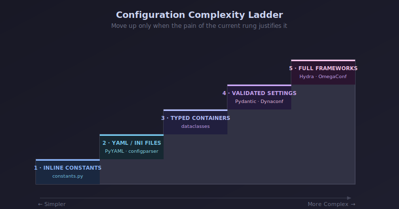
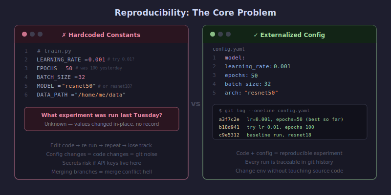
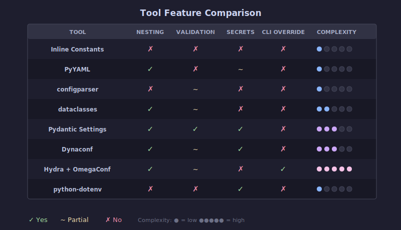
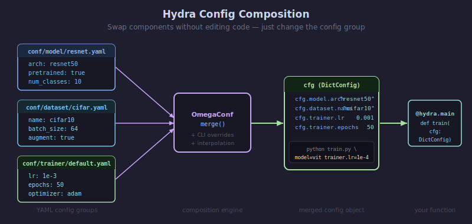
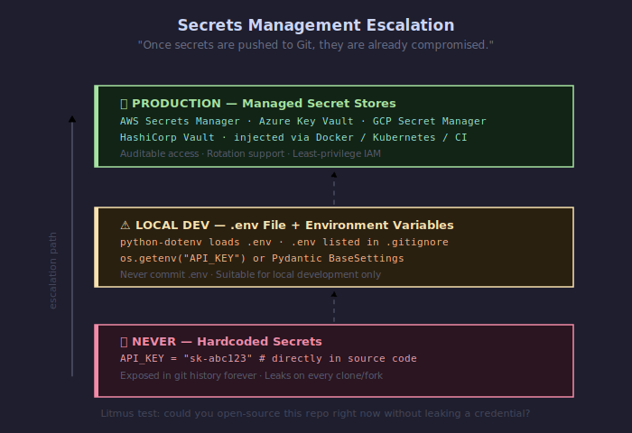
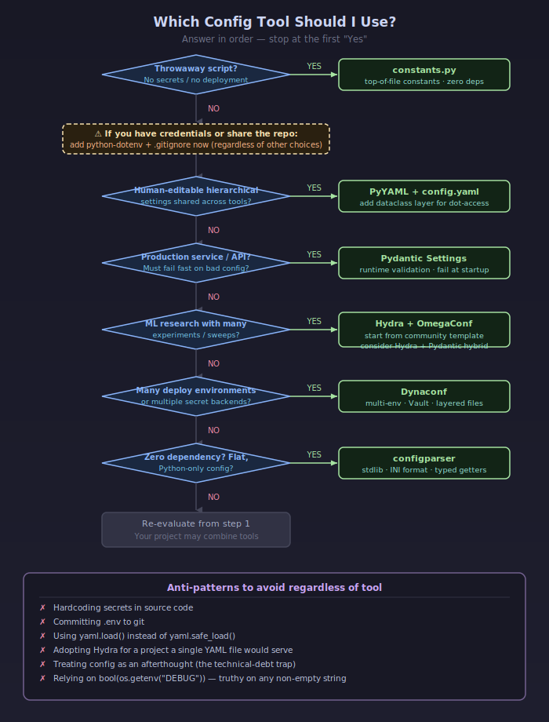

::: {.callout-note title="TL;DR"}
- **There is no single "best" tool** — the right choice scales with project
  complexity: hardcoded constants and a single `config.yaml` (PyYAML) cover
  most solo notebooks and small scripts; **Pydantic Settings** is the best
  default for production ML services that need validation; and **Hydra +
  OmegaConf** is the de facto standard for multi-experiment deep-learning
  research, despite a steep learning curve.

- **Secrets are a separate concern from configuration.** Non-secret config
  (hyperparameters, paths, flags) belongs in version-controlled files; secrets
  (API keys, DB passwords) belong in environment variables, `.env` files
  excluded from git, or a dedicated secrets manager (Vault, AWS Secrets
  Manager). Most config tools delegate secrets handling; only Dynaconf and
  Pydantic Settings integrate it natively.

- **The most common practitioner complaints**: Hydra is "overkill for solo
  projects" and confusingly built on the less-documented OmegaConf; PyYAML has
  the infamous "Norway problem"; configparser can't nest and returns everything
  as strings; and hardcoding silently destroys reproducibility.
:::

## Key Findings

- **Configuration management means separating the values that control your code
  from the code itself** — and in data science it is the difference between
  reproducible experiments and an untrackable mess of edited-in-place
  hyperparameters.
- Tools fall on a complexity ladder: inline constants → YAML/INI files → typed
  containers (dataclasses, Pydantic) → full frameworks (Dynaconf,
  Hydra/OmegaConf). Move up the ladder only when the pain of the current rung
  justifies it.
- **Hydra dominates the ML research niche** — 10.3k stars on the
  facebookresearch/hydra repo, and `hydra-core` logged 15,381,160 downloads in
  the last month per pypistats.org — largely through the community PyTorch
  Lightning + Hydra templates (PyTorch Lightning itself logged 10,792,750
  downloads last month per pypistats.org, a popularity signal for that niche).
  Meanwhile **Pydantic** (27K stars; pypistats.org shows pydantic at
  1,028,307,353 downloads in the last month, and Pydantic's own June 2026 post
  "Pydantic Just Hit 10 Billion Downloads" cites "over 550M downloads per
  month") dominates production/API-adjacent ML.
- A recurring expert recommendation is the **hybrid pattern**: use
  Hydra/OmegaConf or YAML for composition and CLI overrides, then validate the
  merged config with Pydantic for type safety.
- **Secrets management becomes necessary** the moment code is shared, committed
  to git, or deployed — the "litmus test" from the Twelve-Factor App: could you
  open-source your repo right now without leaking a credential?



## What configuration management is

Configuration is everything that controls _how_ your code runs but isn't the
logic itself: file paths, model hyperparameters, database URLs, API ports,
feature flags, and credentials. Configuration management is the discipline of
keeping those values **separate from, and external to, your source code**, so
they can be changed, tracked, and varied across environments without editing
(and re-testing) the code.

The [Twelve-Factor App methodology](#ref-12factor) frames the canonical
principle: "Config varies substantially across deploys, code does not," and a
violation is "storing config as constants in the code." Its litmus test: could
your codebase "be made open source at any moment, without compromising any
credentials?"

In data science specifically, configuration spans three rough buckets (per
[Wencong Yang](#ref-yang)): **data** config (periods, paths, splits), **model**
config (hyperparameters, architecture), and **service** config (API ports,
replicas). A poor config system, as one ML config paper notes, "can lead to
repetitive code that is hard to maintain, understand, and brittle due to
insufficient configuration validation logic" [[confr paper](#ref-confr)].

## Why it matters to data scientists specifically

Google's famous "Hidden Technical Debt in Machine Learning Systems" paper
warns: "both researchers and engineers may treat configuration (and extension
of configuration) as an afterthought. Indeed, verification or testing of
configurations may not even be seen as important." This is the core "why should
I care."

Concretely:

- **Reproducibility.** [Davis David (Analytics Vidhya)](#ref-davis) describes
  the anti-pattern directly: practitioners "change the values of the different
  parameters directly from the source code and run the experiment again and
  again... you can lose track of the different experiments you have done
  previously." A code-version + config-file pair should uniquely determine a
  run's behavior.

  

- **Experiment velocity.** [Jesper Dramsch](#ref-dramsch) reports that Hydra
  configs "sped up my machine learning development workflow" by letting him
  "pass the config and simply add new config settings" instead of "adjusting
  the function signature for every new part."
- **Deployment portability.** [Wencong Yang](#ref-yang) notes hardcoding "may
  work for a quick demo, but it poses two challenges for models in production":
  continuous hyperparameter tuning and easy deployment "in different
  environments."
- **Collaboration & safety.** The moment your notebook becomes a shared repo,
  hardcoded credentials become a liability and edited-in-place constants become
  merge-conflict and reproducibility hazards.

## A Survey of approaches



### 1. Constants at the top of a file (inline hardcoding)

**Overview.** Define values as ALL-CAPS constants at the top of a module or in
a dedicated `constants.py`. The simplest possible step above scattering magic
numbers through the code.

```python
# config.py
TEST_RATIO = 0.2
LEARNING_RATE = 3e-4
DATA_PATH = "data/raw/train.csv"
```

**Pros:** Zero dependencies, zero learning curve, centralized, easy to read.
[IBM's Data Science Best Practices](#ref-ibm) calls constants "the preferred
approach for configuration that is hardly ever changed."

**Cons:** No separation of config from code (a [Twelve-Factor](#ref-12factor)
violation if it varies across deploys); changing config means a code change and
commit; no validation; Python "doesn't have a hard-enforced visibility
concept," so a "constant" can be mutated accidentally.

**Best for:** Tiny solo scripts, notebooks, throwaway prototypes, and genuinely
fixed values (e.g., number of RGB channels = 3). **Never for secrets** —
[IBM](#ref-ibm) is explicit: "it must not be used for secrets!"

**Secrets:** Forbidden. Hardcoded secrets are the canonical security
anti-pattern.

### 2. config.yaml + PyYAML

**Overview:** Store config in a human-readable YAML file; load with PyYAML into
a Python dict. The most common file-based pattern in ML tutorials.

```python
import yaml
with open("config.yaml") as f:
    config = yaml.safe_load(f)   # always safe_load
lr = config["model"]["learning_rate"]
```

**Pros:** Highly readable, supports nesting and lists, language-agnostic,
near-universal in ML. Easy for non-developers to edit.

**Cons:** Several well-documented footguns:

- **`yaml.load()` without `safe_load` can execute arbitrary code** — always use
  `yaml.safe_load` [[Davis David](#ref-davis)].
- **The "Norway problem":** under YAML 1.1 (which PyYAML still follows), the
  bare scalar `NO` parses to boolean `False`, as do `yes/no/on/off/y/n`.
  Country codes, and the variable names `n`/`y` common in DS code, silently
  become booleans. Version numbers like `9.3` become floats. Fix: quote
  ambiguous strings, or use StrictYAML [[bram.us](#ref-norway)].
- Whitespace/indentation sensitivity; dict access (`config["a"]["b"]`) is
  stringly-typed and refactor-unfriendly; no validation or type enforcement out
  of the box.

**Best for:** Most small-to-medium DS projects; sharing configs across
tools/languages; any project where humans hand-edit hierarchical settings.
Often paired with `python-box` for dot-access or a dataclass/Pydantic layer for
validation.

**Secrets:** YAML files can hold secrets but then must be git-ignored; better
to keep secrets out and inject via env vars.

### 3. configparser / .ini files

**Overview.** Python's standard-library parser for INI-format files (sections
of key=value). Zero dependencies.

```python
from configparser import ConfigParser
config = ConfigParser()
config.read("app.ini")
port = config.getint("server", "port")   # explicit type getter
```

**Pros:** Built into Python (no install), simple, human-readable, stable,
comments supported. [One Medium author](#ref-configparser-medium) calls it "a
hidden gem" most developers don't know exists.

**Cons:** **Everything is a string by default** — you must call
`getint`/`getfloat`/`getboolean` manually. **No native nested sections** (Guido
van Rossum deliberately resisted nesting to discourage mixing config with
data). No lists/arrays. Lowercases keys unless you override `optionxform`.
`read()` silently does nothing if the file is missing.

**Best for:** Small, flat, Python-only configs; CLI tools; legacy systems;
"zero-dependency" requirements. Falls apart with hierarchical ML configs.

**Secrets:** No special support; same git-ignore caveats as any file.

### 4. Python dataclasses as config containers

**Overview.** Use `@dataclass` (stdlib, 3.7+) to hold config as typed
attributes, giving dot-access and IDE autocompletion. Often loaded from a
dict/YAML via `from_dict` or `**unpacking`.

```python
from dataclasses import dataclass

@dataclass
class ModelConfig:
    learning_rate: float = 3e-4
    epochs: int = 10
    optimizer: str = "adam"
```

**Pros:** No third-party dependency, type hints, `config.model.lr` instead of
error-prone `config["model"]["lr"]`, testable, less boilerplate than regular
classes. [Alexandra Zaharia](#ref-zaharia) argues config should be handled
"through identifiers rather than strings."

**Cons:** Type hints are **not enforced at runtime** (a dataclass won't reject
`epochs="ten"`); no built-in file loading, validation, or env-var integration —
you build the glue yourself. Extra keys in a source dict raise `TypeError`.

**Best for:** Projects wanting structure and type-hints without a dependency; a
clean schema layer on top of YAML/INI. A natural stepping stone to Pydantic
when you need _enforced_ validation.

**Secrets:** No native support; secrets injected via env vars at construction
time.

### 5. Pydantic / pydantic-settings

**Overview.** Pydantic is a runtime validation library using type annotations;
`pydantic-settings` (its `BaseSettings` class) adds loading from env vars,
`.env` files, secrets directories, and more, with precedence rules.

```python
from pydantic_settings import BaseSettings, SettingsConfigDict

class Settings(BaseSettings):
    model_config = SettingsConfigDict(env_file=".env")
    db_url: str
    learning_rate: float = 3e-4
    api_key: str           # required; errors at startup if missing

settings = Settings()
```

**Pros:** **Runtime type enforcement and validation** — [CodeCut](#ref-codecut)
notes the service "refuses to start" on bad config, turning "mysterious
behavior into clear startup errors." Rich constrained types (`PostgresDsn`,
`RedisDsn`, `EmailStr`), automatic env-var reading, `.env` support, defaults,
nested models. The recommended settings approach in FastAPI. Massive adoption
(over 550M downloads/month per
[Pydantic's own June 2026 post](#ref-pydantic-10b)) means a strong ecosystem
and autocompletion.

**Cons:** "Requires you to write a lot of code if you want features like having
different environments, reading from sources that aren't ENV vars, writing to
files" [[Dynaconf Discussion #608](#ref-dynaconf-discussion)]. The "auto ENV
var reading breaks down for pydantic if you do nested schemas" (needs
`env_nested_delimiter`). It validates but doesn't _compose/merge_ configs
across files the way Hydra does. Can be "verbose for simple projects."

**Best for:** Production ML services and APIs; anything that must fail fast on
misconfiguration; projects already using Pydantic/FastAPI. The validation layer
in a Hydra+Pydantic hybrid.

**Secrets:** Best-in-class delegation/integration. Reads OS env vars and `.env`
(env always overrides `.env`), supports a `secrets_dir` for Docker/Kubernetes
file-based secrets, and has source classes for AWS Secrets Manager and Google
Cloud Secret Manager. Recommended pattern ([Redowan Delowar](#ref-rednafi)):
non-sensitive vars in `.env` (committed or not), sensitive ones injected as
shell env vars.

### 6. Dynaconf

**Overview.** A layered settings manager that loads and merges config from
multiple file formats (TOML, YAML, JSON, INI, .py) and env vars, with
first-class multi-environment support and Vault/Redis secret backends.

```python
from dynaconf import Dynaconf
settings = Dynaconf(
    settings_files=["settings.toml", ".secrets.toml"],
    environments=True,          # [development], [production] sections
    envvar_prefix="MYAPP",
)
print(settings.database.host)
```

**Pros:** Handles dev/staging/prod in a single file via sections; loads from
many sources with defined precedence; lazy loading; reads secrets from
**HashiCorp Vault and Redis**; env-var overrides; Jinja/format-string
interpolation. Strong for "config sprawl" in microservices.

**Cons:** **No predefined schema** — "you don't predefine the structure of your
settings in advance," which makes defaults and validators "a bit more tedious"
and is "not as inherently type-safe as Pydantic" [[Leapcell](#ref-leapcell)].
Steeper learning curve than simple tools. Default `DYNACONF_` env prefix "may
lead to conflicts." Documented performance issues: a maintainer-filed
[GitHub issue #713](#ref-dynaconf-perf) notes `settings.setenv()` "takes 0.2
seconds" each call and v3.1.5 ran "nearly 3 times slower" than v2.2.3 on a
large (~2,500-line) settings file.

**Best for:** Multi-environment apps and microservices; teams wanting one tool
for config + secrets across many formats; data-engineering pipelines with many
connectors.

**Secrets:** Native. Encrypted values, Vault and Redis integration, separate
`.secrets.toml` convention.

### 7. Hydra (Meta/FAIR)

**Overview.** A framework (built on OmegaConf) for **composing hierarchical
configs from multiple YAML files** and overriding them from the command line,
with automatic per-run output directories and multi-run parameter sweeps.
Created by Facebook/Meta Research; the dominant config tool in deep-learning
research.

```python
import hydra
from omegaconf import DictConfig

@hydra.main(config_path="conf", config_name="config", version_base=None)
def train(cfg: DictConfig):
    print(cfg.model.lr)        # dot-access
    # override at CLI: python train.py model.lr=1e-3 --multirun model.lr=1e-3,1e-4
```



**Pros:** Config **composition** via config groups (swap `model=resnet` or
`dataset=v2`); powerful CLI overrides; **`--multirun` sweeps** across
hyperparameters; automatic timestamped output dir per run capturing exact
params (huge for reproducibility); strong ML ecosystem (the PyTorch Lightning +
Hydra templates).

**Cons:** The most-criticized tool here. [Dan MacKinlay](#ref-mackinlay)
writes: Hydra is "at a mind-melting intersection of opinionation and
flexibility" and "you end up needing to know that it is built upon OmegaConf,
which is less maintained and worse documented than Hydra" — "these days I use
simpler systems... because hydra made me confused." Validation is "offloaded
largely to application" without Pydantic [[Pydra/TDS](#ref-pydra)]. Lazy
interpolation can resolve at the wrong time (e.g., `now:` timestamps differing
between training and inference) [[Dramsch](#ref-dramsch)]. Widely called
**overkill for solo or simple projects**.

**Best for:** Research with many experiments/hyperparameter sweeps; deep
learning; teams needing reproducible, composable configs and per-run artifact
tracking. The [lightning-hydra-template](#ref-lightning-hydra) authors are
explicit: it's "a fast experimentation tool," "not fitted to be a
production/deployment environment."

**Secrets:** Delegates entirely. Use env-var interpolation (`${oc.env:VAR}`) or
pair with python-dotenv/a secrets manager.

### 8. OmegaConf

**Overview.** The hierarchical config engine **underneath Hydra**, usable
standalone. Merges configs from YAML, dataclasses, and CLI into one object with
a consistent API, and supports variable interpolation. (2.4k stars; omegaconf
logged 32,488,956 downloads in the last month per pypistats.org.)

```python
from omegaconf import OmegaConf
base = OmegaConf.load("config.yaml")
cli = OmegaConf.from_cli()
cfg = OmegaConf.merge(base, cli)
print(cfg.model.lr)   # supports ${...} interpolation
```

**Pros:** **Variable interpolation** (`${train.num_classes}` referenced
elsewhere); merges multiple sources cleanly; dot-access; optional type-checking
via structured configs (dataclasses); the serialization workhorse
(`OmegaConf.to_container(cfg, resolve=True)`) loggers expect
[[Dramsch](#ref-dramsch)].

**Cons:** [MacKinlay](#ref-mackinlay) notes it is "less maintained and worse
documented than Hydra." Interpolation is **lazy**, which can bite you — resolve
early before saving checkpoints. The ANTLR dependency for interpolation grammar
is heavy.

**Best for:** When you want interpolation and merging without Hydra's full
framework; as the layer you reach into when Hydra's abstractions leak;
structured-config type checking.

**Secrets:** Supports `${oc.env:VAR}` env interpolation; otherwise delegates.

### 9. python-dotenv / .env files

**Overview.** Loads key-value pairs from a `.env` file into environment
variables, which you then read with `os.getenv`. The standard local-development
secrets pattern. (8.8k stars; ~595.7M downloads/month per pypistats.org.)

```python
from dotenv import load_dotenv
import os
load_dotenv()
api_key = os.getenv("API_KEY")
db_url = os.getenv("DATABASE_URL")
```

**Pros:** Dead simple; keeps secrets out of code; aligns with
[Twelve-Factor](#ref-12factor); near-universal; supports per-environment files
(`.env.development`, `.env.production`). The standard way to load AWS/GCP keys
and DB credentials in DS notebooks.

**Cons:** **No validation or typing** — `os.getenv` returns strings
([CodeCut](#ref-codecut) flags `bool(os.getenv("DEBUG"))` as a classic bug,
since any non-empty string is truthy). Flat namespace only. It is a
_secrets/env loader_, not a full config system. **`.env` must never be
committed** (add to `.gitignore`).

**Best for:** Local development secrets and environment-specific values; the
secrets half of a "PyYAML/Pydantic for config + dotenv for secrets" split.
Production teams inject env vars via Docker/K8s/CI rather than shipping `.env`
files [[Vivek](#ref-vivek)].

**Secrets:** This _is_ the entry-level secrets tool. "In real deployments, .env
files are not used — environment variables are injected by Docker, Kubernetes,
CI/CD" and secrets live in AWS Secrets Manager / Azure Key Vault / Vault.

## How secrets fit in (cross-cutting)

- **Config vs. secrets are different problems.** Non-secret config
  (hyperparameters, paths, flags) is meant to be versioned and shared. Secrets
  (passwords, API keys, tokens) must never enter git. Most config _files_ can
  technically hold secrets but shouldn't.
- **When is secrets management necessary?** Per [Twelve-Factor](#ref-12factor):
  as soon as code is shared with a team, committed to a repo, or deployed. For
  a purely local solo notebook with no credentials, it isn't. The litmus test:
  could you open-source the repo right now safely?
- **The escalation ladder for secrets:** hardcoding (never) → environment
  variables / `.env` (local dev) → cloud secret managers (AWS Secrets Manager,
  Azure Key Vault, GCP Secret Manager) or HashiCorp Vault (production).
  ["Once secrets are pushed to Git, they are already compromised"](#ref-gitguardian)
  — rotate immediately.
- **Tool integration:** dotenv (load only), Pydantic Settings (env + `.env` +
  secrets_dir + cloud manager sources), Dynaconf (Vault/Redis + encrypted
  values) integrate secrets natively. Hydra, OmegaConf, PyYAML, configparser,
  dataclasses, and constants **delegate** secrets to env vars or an external
  manager.



## A decision framework

Ask these questions in order:

1. **Is it a throwaway notebook/script with no secrets and no deployment?** →
   Constants at the top of the file (or a small `config.py`). Don't
   over-engineer.
2. **Do you have credentials, or share the repo?** → Add **python-dotenv** +
   `.gitignore` for secrets immediately, regardless of what else you use.
3. **Do humans hand-edit hierarchical settings, shared across tools?** →
   **config.yaml + PyYAML** (with `safe_load`, and quote ambiguous strings).
   Add a **dataclass** layer if you want dot-access/structure without a
   dependency.
4. **Is this going to production / an API, and must fail fast on bad config?**
   → **Pydantic Settings**. It's the best default for production ML services
   and validation-critical pipelines.
5. **Do you run many experiments / hyperparameter sweeps in research DL?** →
   **Hydra + OmegaConf**, ideally from a
   [community template](#ref-lightning-hydra). Accept the learning curve; reach
   for the hybrid (Hydra composes, Pydantic validates) if you need strict
   validation [[Pydra/TDS](#ref-pydra)].
6. **Many deployment environments / microservices / multiple secret backends?**
   → **Dynaconf** (or Pydantic Settings + a secrets manager).
7. **Zero-dependency, flat, Python-only config?** → **configparser**.



**Benchmarks that should change your choice:**

- If you find yourself editing constants to run a different experiment → move
  to files (step 3).
- If a string-vs-int config bug reaches production → add validation (Pydantic,
  step 4).
- If you're copy-pasting whole YAML files to vary one component, or manually
  looping over hyperparameter combinations → adopt Hydra composition/multirun
  (step 5).
- If you maintain more than 2-3 environment variants in parallel → Dynaconf or
  Pydantic environments (step 6).
- If your config exceeds a few hundred lines or several thousand across
  environments → watch Dynaconf performance; consider splitting/composition.

**Anti-patterns to avoid regardless of tool:** hardcoding secrets; committing
`.env`; using `yaml.load` instead of `safe_load`; treating config as an
afterthought (the technical-debt trap); and over-adopting Hydra for a solo
project that a single YAML file would serve.

## Recommendations

1. **Start at the lowest rung that fits.** For a solo notebook, a `config.py`
   of constants plus python-dotenv for any keys is enough. Don't adopt Hydra
   "because ML papers use it."
2. **Add python-dotenv + `.gitignore` the instant you touch a credential.**
   This is the single highest-leverage habit for safety. Rotate any secret that
   ever hit git.
3. **For production ML services/APIs, default to Pydantic Settings.** The
   fail-fast validation pays for itself the first time it catches a bad env var
   at startup instead of mid-pipeline.
4. **For research with sweeps, adopt Hydra via a community template** (e.g.,
   lightning-hydra-template) rather than from scratch — practitioners
   universally report the blank-page problem. Resolve configs early to avoid
   lazy-interpolation bugs, and consider the Hydra-composes/Pydantic-validates
   hybrid.
5. **For many environments or secret backends, evaluate Dynaconf**, but
   benchmark if your settings files are large (thousands of lines) given
   documented performance regressions.
6. **Always `yaml.safe_load`, quote ambiguous YAML scalars, and use
   configparser's typed getters.** These eliminate the most common
   silent-corruption bugs.
7. **Push secrets to a managed store (Vault / cloud secret manager) before
   production**; `.env` is for local dev only.

## Caveats

- **Adoption numbers are point-in-time and noisy.** GitHub stars and PyPI
  downloads (observed June 10, 2026) overstate real human usage — PyPI counts
  include CI/mirror/transitive-dependency traffic, which inflates low-level
  libraries like PyYAML, python-dotenv, and Pydantic disproportionately. Treat
  them as rough popularity signals, not usage censuses.
- **Several sources are vendor or SEO content** (e.g., tool-comparison blogs, a
  Dynaconf "2025 ML" post making unsourced quantitative claims like "62% of
  Fortune 500 ML teams" and "reduces failures by 75%"). I have deliberately
  **excluded those unverifiable statistics**; treat any such precise adoption
  percentages with skepticism.
- **The YAML "Norway problem" is version-dependent.** It stems from YAML 1.1
  implicit typing; YAML 1.2's Core Schema fixes it, but PyYAML still defaults
  to 1.1 behavior, so the footgun remains live in most Python code today.
- **Hydra criticism is partly subjective.** The same flexibility one
  practitioner finds "mind-melting" another finds essential for sweeps; the
  strong consensus is narrower: it shines for research experimentation and is
  poorly suited to production deployment and data-pipeline orchestration.
- **Tool boundaries blur.** Many real projects combine tools (YAML + dataclass;
  Hydra + Pydantic; PyYAML config + dotenv secrets), so "choosing one" is often
  choosing a primary plus a secrets strategy.
- Experiment-tracking tools (MLflow, Weights & Biases) overlap conceptually
  with config management but were intentionally excluded from this guide per
  scope.

## Further reading

- Omry Yadan (Hydra author),
  ["Hydra — A fresh look at configuration for Machine Learning projects"](https://medium.com/pytorch/hydra-a-fresh-look-at-configuration-for-machine-learning-projects-50583187b710)
  — the canonical Hydra rationale.
- Jesper Dramsch,
  ["How Hydra configs have sped up my machine learning development workflow"](https://dramsch.net/articles/config-driven-machine-learning-development-with-hydra/)
  — pragmatic ML walkthrough with gotchas.
- Dan MacKinlay,
  ["Hydra for configuring and tracking machine learning experiments"](https://danmackinlay.name/notebook/hydra_ml)
  — the best critical/skeptical take.
- "Pydra: Configuration management for model training experiments using
  Pydantic and Hydra,"
  [Towards Data Science](https://towardsdatascience.com/configuration-management-for-model-training-experiments-using-pydantic-and-hydra-d14a6ae84c13/)
  — the hybrid pattern in detail.
- Redowan Delowar,
  ["Pedantic configuration management with Pydantic"](https://rednafi.com/python/config-management-with-pydantic/)
  — env/secret separation patterns.
- Wencong Yang,
  ["From Data Science to Production: Configuration Management for ML Code"](https://medium.com/@yangwconion/from-data-science-to-production-configuration-management-d4926021e369)
  — data/model/service config framing.
- ["The Twelve-Factor App," Factor III: Config](https://12factor.net/config) —
  the foundational principle.
- GitGuardian,
  ["How to Handle Secrets in Python"](https://blog.gitguardian.com/how-to-handle-secrets-in-python/)
  — the secrets escalation ladder.
- Ruud van Asseldonk,
  ["The YAML document from hell"](https://ruudvanasseldonk.com/2023/01/11/the-yaml-document-from-hell)
  — every YAML footgun.
- Leapcell,
  ["Pydantic BaseSettings vs. Dynaconf"](https://leapcell.io/blog/pydantic-basesettings-vs-dynaconf-a-modern-guide-to-application-configuration)
  — head-to-head decision guidance.
- [lightning-hydra-template](https://github.com/ashleve/lightning-hydra-template)
  (ashleve, GitHub) — reference ML project structure with honest "why you
  shouldn't use it" notes.

## References

<a id="ref-12factor"></a> **[Twelve-Factor App]** Wiggins, A. _The
Twelve-Factor App_, Factor III: Config. https://12factor.net/config

<a id="ref-yang"></a> **[Yang 2023]** Yang, W. "From Data Science to
Production: Configuration Management for ML Code." _Medium_, Dec 2023.
https://medium.com/@yangwconion/from-data-science-to-production-configuration-management-d4926021e369

<a id="ref-confr"></a> **[confr paper]** Arro, M. "confr – A Configuration
System for Machine Learning Projects." _CEUR Workshop Proceedings_, Vol. 3226.
https://ceur-ws.org/Vol-3226/paper10.pdf

<a id="ref-ibm"></a> **[IBM Best Practices]** IBM. "Configuration Management."
_IBM Data Science Best Practices_.
https://ibm.github.io/data-science-best-practices/configuration_management.html

<a id="ref-davis"></a> **[Davis 2021]** David, D. "How to Write Configuration
Files in Your Machine Learning Project." _Analytics Vidhya / Medium_, 2021.
https://medium.com/analytics-vidhya/how-to-write-configuration-files-in-your-machine-learning-project-47bc840acc19

<a id="ref-dramsch"></a> **[Dramsch]** Dramsch, J. "How Hydra configs have sped
up my machine learning development workflow." _dramsch.net_.
https://dramsch.net/articles/config-driven-machine-learning-development-with-hydra/

<a id="ref-norway"></a> **[Norway Problem]** bram.us. "YAML: The Norway
Problem." Jan 2022. https://www.bram.us/2022/01/11/yaml-the-norway-problem/

<a id="ref-configparser-medium"></a> **[Kumar]** Kumar, A. "Most Developers
Don't Know Python Has a Built-In Config File Parser." _The Pythonworld /
Medium_.
https://medium.com/the-pythonworld/most-developers-dont-know-python-has-a-built-in-config-file-parser-ff0a850c8cb3

<a id="ref-zaharia"></a> **[Zaharia]** Zaharia, A. "Python configuration and
data classes." _alexandra-zaharia.github.io_.
https://alexandra-zaharia.github.io/posts/python-configuration-and-dataclasses/

<a id="ref-codecut"></a> **[CodeCut]** "Pydantic-settings: Type-Safe Config
Management." _CodeCut_.
https://codecut.ai/pydantic-settings-type-safe-config-management/

<a id="ref-pydantic-10b"></a> **[Pydantic 10B]** Pydantic. "Pydantic Just Hit
10 Billion Downloads." _pydantic.dev_, Jun 2026.
https://pydantic.dev/articles/pydantic-10-billion-downloads

<a id="ref-dynaconf-discussion"></a> **[Dynaconf Discussion #608]**
dynaconf/dynaconf. "Dynaconf 4.0 changes and ideas." _GitHub Discussions_,
#608. https://github.com/dynaconf/dynaconf/discussions/608

<a id="ref-rednafi"></a> **[Rednafi]** Delowar, R. "Pedantic configuration
management with Pydantic." _rednafi.com_.
https://rednafi.com/python/config-management-with-pydantic/

<a id="ref-leapcell"></a> **[Leapcell]** "Pydantic BaseSettings vs. Dynaconf: A
Modern Guide to Application Configuration." _Leapcell_.
https://leapcell.io/blog/pydantic-basesettings-vs-dynaconf-a-modern-guide-to-application-configuration

<a id="ref-dynaconf-perf"></a> **[Dynaconf Issue #713]** dynaconf/dynaconf.
"Performance concerns." _GitHub Issues_, #713.
https://github.com/dynaconf/dynaconf/issues/713

<a id="ref-mackinlay"></a> **[MacKinlay]** MacKinlay, D. "Hydra for configuring
and tracking machine learning experiments." _danmackinlay.name_.
https://danmackinlay.name/notebook/hydra_ml

<a id="ref-pydra"></a> **[Pydra/TDS]** "Configuration management for model
training experiments using Pydantic and Hydra." _Towards Data Science_.
https://towardsdatascience.com/configuration-management-for-model-training-experiments-using-pydantic-and-hydra-d14a6ae84c13/

<a id="ref-lightning-hydra"></a> **[lightning-hydra-template]** Ashleve.
"PyTorch Lightning + Hydra template." _GitHub_.
https://github.com/ashleve/lightning-hydra-template

<a id="ref-vivek"></a> **[Vivek]** Vivek. "Managing Secrets in Real-World
Production Python Projects." _Medium_.
https://medium.com/@vivekmcm1/managing-secrets-in-real-world-production-python-projects-0a260574f33e

<a id="ref-gitguardian"></a> **[GitGuardian]** GitGuardian. "How to Handle
Secrets in Python." _blog.gitguardian.com_.
https://blog.gitguardian.com/how-to-handle-secrets-in-python/
