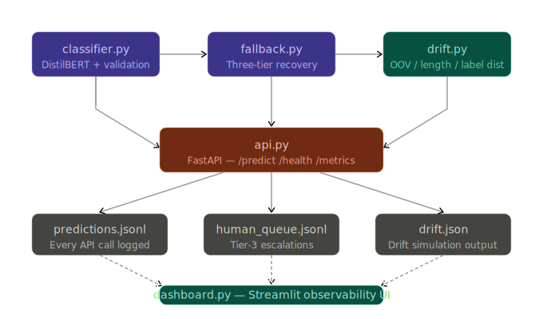
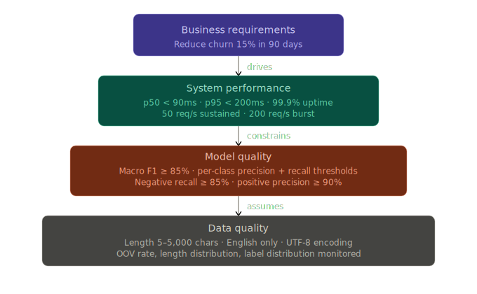
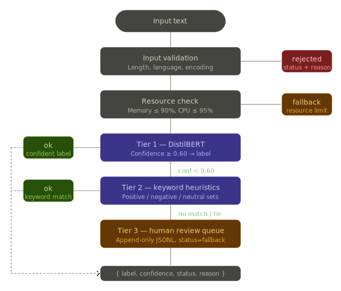
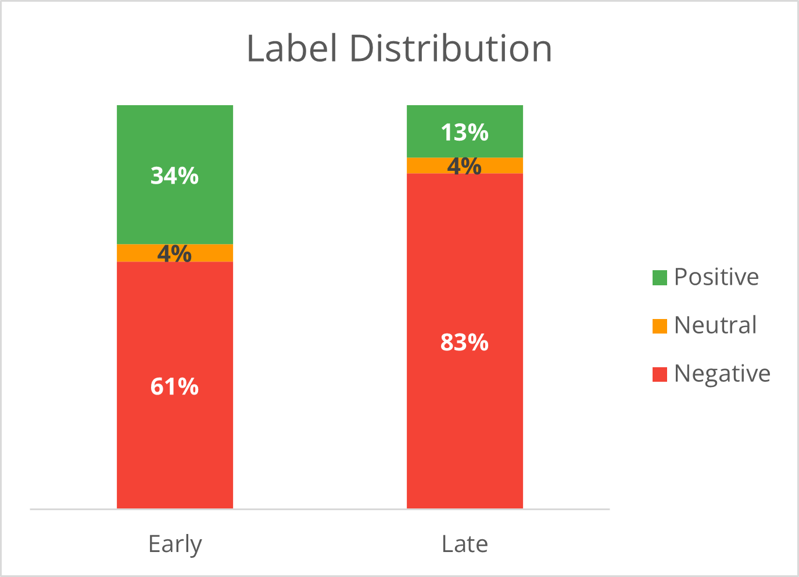

::: {.callout-note title="TL;DR"}
- **Problem:** Classify 130M Amazon customer reviews to trigger churn-prevention interventions — 20,000 reviews/day, 99.9% uptime, and a business that can't afford silent failures or surprise exceptions.

- **What I built:** A production-ready 3-tier fallback classifier (fine-tuned DistilBERT → rule-based keyword matching → human review queue) with FastAPI serving, drift detection across three independent signals, and a Streamlit observability dashboard.

- **Key result:** The system handles every failure mode — non-English input, low confidence, resource pressure, training-serving skew — with a structured `{label, confidence, status, reason}` response and never raises to the caller. On a real Amazon temporal split, drift detection flagged a review-bombing event (label distribution shifted from 34% → 13% positive) before F1 had time to visibly degrade; OOV-only monitoring would have missed it entirely.
:::

There's a specific moment every ML practitioner eventually hits. You've trained a sentiment classifier. It scores 87% accuracy on a held-out test set. The confusion matrix looks reasonable. You paste a few reviews into a `predict()` call and it works. You close the notebook feeling good.

Then someone asks: "Can we deploy this?"

That question opens a chasm. On one side: a model that works in a notebook. On the other: a system that handles 20,000 reviews a day with 99.9% uptime, degrades gracefully under memory pressure, detects when its training distribution is shifting, and never crashes the service when it encounters bad input. Crossing that chasm is what ML engineering is actually about.

This post documents the full journey, using the [Amazon Customer Reviews 2023 dataset](https://huggingface.co/datasets/McAuley-Lab/Amazon-Reviews-2023) as the proving ground.

```{=html}
<style>
  .repo-card {
    background: color-mix(in srgb, var(--bs-body-bg) 92%, var(--bs-body-color) 8%);
    border: 0.5px solid rgba(var(--bs-body-color-rgb), 0.15);
    border-radius: var(--bs-border-radius-lg);
    padding: 1.1rem 1.25rem;
    max-width: 560px;
  }

  .repo-card:hover {
    border-color: rgba(var(--bs-body-color-rgb), 0.4);
  }

  .repo-top {
    display: flex;
    align-items: center;
    gap: 10px;
    margin-bottom: 6px;
  }

  .repo-icon {
    color: var(--bs-secondary-color);
    font-size: 18px;
    flex-shrink: 0;
  }

  .repo-name {
    font-size: 15px;
    font-weight: 500;
    color: var(--bs-link-color);
    text-decoration: none;
  }

  .repo-name:hover {
    text-decoration: underline;
  }

  .repo-desc {
    font-size: 13px;
    color: var(--bs-secondary-color);
    margin: 0 0 12px;
    line-height: 1.5;
  }

  .repo-tags {
    display: flex;
    flex-wrap: wrap;
    gap: 6px;
    margin-bottom: 12px;
  }

  .tag {
    font-size: 11px;
    padding: 3px 9px;
    border-radius: 20px;
    background: rgba(var(--bs-info-rgb), 0.15);
    color: var(--bs-link-color);
    font-family: var(--bs-font-monospace);
  }

  .repo-footer {
    display: flex;
    align-items: center;
    justify-content: space-between;
  }

  .repo-lang {
    display: flex;
    align-items: center;
    gap: 6px;
    font-size: 12px;
    color: var(--bs-secondary-color);
  }

  .lang-dot {
    width: 10px;
    height: 10px;
    border-radius: 50%;
    background: #3572A5;
    flex-shrink: 0;
  }

  .view-btn {
    display: inline-flex;
    align-items: center;
    gap: 5px;
    font-size: 12px;
    color: var(--bs-secondary-color);
    text-decoration: none;
    border: 0.5px solid rgba(var(--bs-body-color-rgb), 0.15);
    border-radius: var(--bs-border-radius);
    padding: 5px 10px;
    transition: background 0.15s, border-color 0.15s;
  }

  .view-btn:hover {
    background: color-mix(in srgb, var(--bs-body-bg) 85%, var(--bs-body-color) 15%);
    border-color: rgba(var(--bs-body-color-rgb), 0.4);
    color: var(--bs-body-color);
  }
</style>
<div class="repo-card">
  <div class="repo-top">
    <i class="bi bi-github repo-icon" aria-hidden="true"></i>
    <a class="repo-name" href="https://github.com/msburns24/amazon-sentiment-ml-eng">msburns24 /
      amazon-sentiment-ml-eng</a>
  </div>
  <p class="repo-desc">Production-ready sentiment classifier on 130M Amazon reviews — fallback chain, drift detection,
    FastAPI serving, and Streamlit observability dashboard. Run locally: <code>pip install -e . && uvicorn app.main:app</code></p>
  <div class="repo-tags">
    <span class="tag">python</span>
    <span class="tag">transformers</span>
    <span class="tag">fastapi</span>
    <span class="tag">mlops</span>
    <span class="tag">concept-drift</span>
  </div>
  <div class="repo-footer">
    <div class="repo-lang">
      <span class="lang-dot"></span>
      <span>Python</span>
    </div>
    <a class="view-btn" href="https://github.com/msburns24/amazon-sentiment-ml-eng">
      View on GitHub <i class="bi bi-arrow-right" style="font-size:12px" aria-hidden="true"></i>
    </a>
  </div>
</div>
<br />

```



## 1. The Gap Between Notebook Accuracy and Production Readiness

A notebook-trained model answers one question: *given this exact dataset, with this exact preprocessing, can the model learn the signal?* It answers nothing about:

- What happens when input arrives in an unexpected format
- What happens when confidence is low
- What happens when the model service is under CPU pressure
- What happens six months after training, when users have started leaving reviews in a different style
- What the business is actually trying to accomplish

Accuracy on a test set is a **necessary condition**, not a sufficient one. An 87% accurate model that silently returns wrong predictions for 13% of inputs — with no flagging, no fallback, no audit trail — is not a production system. It's a liability.

The root problem is that notebooks optimize for the happy path. You load clean data, train, evaluate, celebrate. Production optimizes for *what goes wrong*, because something always does.

The Amazon reviews dataset makes this visceral. It spans 1996 to 2023, covers every product category from industrial tools to baby food, and contains reviews in multiple languages, reviews that are a single emoji, reviews that are 8,000-word essays, and reviews that are clearly fake. Any one of those will break a notebook-grade classifier in ways the test set never hinted at.

## 2. Requirements First: A Walkthrough

Before writing a single line of model code, the question is: *what does this system need to do?*

This isn't academic process-following. Requirements documents are the artifact that makes engineers and stakeholders talk about the same system. Without them, "production-ready" means something different to everyone in the room.

Here's the structure used, working top-down from business intent.

 

### Business requirements

The scenario: classify customer reviews to trigger retention interventions. A negative review is a signal that a customer might churn. A human agent follows up. The business metric is customer churn rate.

> **Primary goal:** Decrease customer churn by 15% within 90 days of deployment.

That single sentence changes everything about how you design the system. It means:

- False negatives (missed negatives) cost real money — unhappy customers you didn't catch
- False positives (neutral/positive reviews flagged as negative) waste agent time
- The model doesn't just need to be accurate; it needs to fail in *predictable, bounded ways*

### System performance requirements

From that business goal, concrete numbers emerge:

| Metric | Target |
|---|---|
| p50 latency | < 90 ms |
| p95 latency | < 200 ms |
| Throughput (sustained) | 50 req/s |
| Throughput (burst) | 200 req/s |
| Availability | 99.9% (≈ 44 min downtime/month) |
| Daily volume | 20,000 reviews (max 100,000) |

These numbers aren't pulled from thin air — they're derived from the review volume of a mid-sized e-commerce operation and the response time a human agent can realistically act on.

### Model quality requirements

The three-class structure (positive / neutral / negative) requires per-class thresholds, not just a single accuracy number. Each class has a different failure cost:

| Class | Precision | Recall | Why |
|-------|---|---|---|
| Negative | ≥ 75% | ≥ 85% | Missing a negative (low recall) costs more than an unnecessary call (low precision) |
| Positive | ≥ 90% | ≥ 70% | Accidentally flagging a happy customer as negative and calling them is a trust-destroying experience |
| Neutral | ≥ 80% | ≥ 80% | Mostly a safety valve — misclassified neutrals should fall into the above buckets |

Overall: macro F1 ≥ 85%.

### Data quality requirements

The model makes assumptions about its inputs. Every one of those assumptions needs to be made explicit and guarded at the boundary:

- **Text length:** 5–5,000 characters. Under 5: no signal. Over 5,000: likely a data pipeline bug.
- **Language:** English only (v1). Detect with `langdetect`, reject non-English with a structured error — don't let the model produce a confident wrong prediction on French text.
- **Encoding:** UTF-8. Encoding errors above 5% trigger a pipeline alert.
- **Drift:** OOV rate, text length distribution, and label distribution are all monitored with configured alert thresholds.

The data quality section is where requirements documents usually run thin. It shouldn't. The most common source of silent production failures isn't a bad model — it's bad data that the model was never trained to handle gracefully.

### A note on label derivation

The Amazon dataset doesn't come with sentiment labels. It comes with star ratings, and those are a noisy proxy. The mapping used here — 1–2 stars to negative, 3 stars to neutral, 4–5 stars to positive — is intuitive but imperfect. A 2-star review that says "the packaging was fine but the product itself was great" isn't negative. A 5-star review that's just a brand's promotional copy isn't really positive sentiment either.

This tradeoff is documented explicitly and treated as a known limitation rather than a hidden assumption. At scale, the noise averages out. In edge cases, it doesn't, and those edge cases are exactly the ones the fallback chain is designed to catch.

## 3. Failure Modes: When the Amazon Dataset Bites You

With requirements written, the next step is to systematically enumerate what can go wrong. The Amazon dataset is an excellent stress-test because it actually triggers all of these.



### F1: Non-English input

The dataset contains millions of Spanish, French, German, and Japanese reviews. Pass one of these to a model trained on English text and you get a confident, wrong prediction. There's no error — just a label.

**Mitigation:** Language detection runs before every inference call. Non-English inputs return `status="rejected"` with the detected language code. The calling system knows exactly what happened.

```python
detected_lang = langdetect.detect(text)
if detected_lang != "en":
    return PredictionResult(
        status="rejected",
        reason=f"Unsupported language: '{detected_lang}'"
    ).to_dict()
```

This is a boundary check, not a model concern. The model never sees these inputs.

### F2: Very short and very long reviews

One-word reviews ("Junk", "Perfect", "Meh") are common on Amazon. Inputs under 5 characters get rejected — there's no reliable signal to extract. Inputs over 5,000 characters, which do appear (usually via copy-paste of product manuals or pasted terms and conditions), are either truncated or rejected depending on configuration.

### F3: Low-confidence predictions

DistilBERT fine-tuned on Amazon reviews outputs a three-class probability distribution. When it's uncertain, it shouldn't be trusted to pick a side. Any prediction where the top-class confidence score falls below 0.75 is a candidate for the neutral label. Below 0.60 — the confidence gate — the prediction is demoted to `status="fallback"` and passed to the rule-based tier.

This is the most commonly triggered failure mode in production. It's not a failure of the model — it's a signal that the input is genuinely ambiguous, and the system is handling that ambiguity explicitly rather than hiding it behind a spurious confident prediction.

### F4: Resource pressure

Under memory pressure, model inference can corrupt or crash. The system checks before every request:

```python
mem = psutil.virtual_memory().percent
cpu = psutil.cpu_percent(interval=0.1)

if mem > 90.0 or cpu > 95.0:
    return PredictionResult(status="fallback", reason="Resource limit exceeded").to_dict()
```

This looks paranoid until the first time a memory leak in a co-located service causes your sentiment classifier to start returning garbage.

### F5: Training-serving skew

This is the silent killer. The model trains on reviews from an early time window. Six months later, the ingestion team switches to a new parser that doesn't strip HTML. The model starts seeing `&amp;` and `<br/>` tokens in every review. F1 degrades over weeks while the team looks at every other signal first.

The mitigation is an OOV rate check on every prediction. DistilBERT's WordPiece tokenizer almost never produces true `[UNK]` tokens — its vocabulary is large enough to handle essentially any well-formed English text. So a spike in the UNK rate is a reliable proxy for "something in the input distribution changed."

```python
n_unk = sum(1 for t in tokens if t == tokenizer.unk_token)
oov_rate = n_unk / len(tokens)
# Alert if oov_rate > 0.05
```

## 4. System Architecture

The system is organized as five decoupled modules, each with a single clearly defined responsibility.

The architecture is deliberately flat and file-based rather than database-backed. Every output is inspectable with a text editor, testable without infrastructure dependencies, and directly readable by the dashboard without an intermediate API layer. That simplicity is a feature, not a constraint — it keeps the system legible while the patterns it demonstrates are portable to any production stack.

The core contract runs through all five modules: every function that touches the classification path returns a consistent `{label, confidence, status, reason}` dictionary and never raises an exception to its caller. That contract is what makes the modules composable.

## 5. The Fallback Chain

The classifier doesn't exist in isolation. It sits at the top of a three-tier fallback chain designed so that *every input gets a structured response*, regardless of what goes wrong.

::: {.panel-tabset}

### Business View



Every review that enters the system exits with one of three outcomes: a confident model prediction, a rule-based fallback, or escalation to a human reviewer. Nothing is silently dropped or causes an unhandled exception.

**Why three tiers?**

- **Tier 1 (DistilBERT):** Handles the majority of reviews with high confidence. When confidence falls below threshold, it hands off rather than guessing.
- **Tier 2 (Keyword rules):** Fast, auditable, and handles the obvious cases — reviews full of "excellent" or "scam" that the model was uncertain about. Keeps the human queue small.
- **Tier 3 (Human queue):** An append-only log of genuinely ambiguous cases. These are the highest-value training examples for future model improvements.

The downstream system — the churn-intervention workflow — never needs to handle exceptions or write defensive wrappers. The classifier always returns a result.

### Technical View

Every path through the fallback chain produces the same four-field response contract:

```json
{
  "label": "negative",
  "confidence": 0.92,
  "status": "ok",
  "reason": ""
}
```

The `status` field encodes which tier responded:

| Status | Meaning |
|---|---|
| `"ok"` | Model prediction above confidence gate (≥ 0.60) |
| `"fallback"` | Keyword rules resolved it, or resource/confidence gate fired |
| `"rejected"` | Input failed validation (non-English, too short, too long) |

This design principle — *never raise to the caller* — is the single most important production pattern in the codebase. Downstream systems treat the classifier as a reliable function, not a fragile service.

The keyword tier matches three sets (18 positive, 18 negative, 11 neutral terms) and picks the class with the most hits. Ties and no-matches escalate to Tier 3 rather than guessing.

The human queue (Tier 3) is an append-only JSONL file with a timestamp and reason code on every record. It feeds both the observability dashboard and, eventually, the retraining pipeline.

### Code

The confidence gate that routes Tier 1 → Tier 2:

```python
if result["confidence"] < CONFIDENCE_GATE:
    return PredictionResult(
        status="fallback",
        reason=f"Confidence {result['confidence']:.2f} below gate {CONFIDENCE_GATE}"
    ).to_dict()
```

See §3 below for additional code snippets covering language detection, resource guards, and OOV rate checking — each maps to one of the five failure modes the chain is designed to handle.

:::


## 6. Serving Predictions: The FastAPI Layer

Wrapping `classify()` in a web service sounds straightforward, but there are a handful of decisions worth making deliberately.

**Model loading.** The model loads exactly once, at application startup, using an async lifespan context manager. This is not the default if you reach for a naive `@app.on_event("startup")` — you need the newer `lifespan` pattern to ensure proper teardown. Regardless of implementation, the critical constraint is that the model must not load per-request. A DistilBERT checkpoint takes several seconds to load; doing it per-request would make your p95 latency measurement meaningless.

**The `/predict` endpoint** accepts a JSON body with a single `text` field, runs the full classification and fallback pipeline, logs the result to `predictions.jsonl`, and returns the four-field response. If the text is empty or whitespace-only, it returns a 422 before any inference runs — FastAPI's validation layer handles this before the classifier ever sees the input.

**The `/health` endpoint** returns `{"status": "ok"}` and nothing else. This is a liveness probe for orchestrators. It should always return 200 as long as the process is alive, which means it should not check model readiness or database connectivity. Those belong on a separate `/ready` endpoint when you need them.

**The `/metrics` endpoint** is where the observability story comes together. It maintains an in-memory rolling window over the last 1,000 predictions — small enough to be fast, large enough to be statistically meaningful. It exposes:

- `total_requests`: cumulative count since startup
- `status_breakdown`: counts for `ok`, `rejected`, and `fallback` statuses
- `rolling_oov_rate`: mean OOV fraction across the window
- `rolling_confidence`: mean model confidence for predictions that reached the model
- `confidence_histogram`: distribution bucketed into five equal ranges from 0.0 to 1.0

The histogram is particularly useful. A healthy system has most mass in the 0.8–1.0 bucket. A system that's drifting or seeing out-of-distribution input will show a spreading distribution — more mass in the 0.4–0.6 range as the model becomes less decisive. That's a signal you can act on before F1 starts to visibly drop.

## 7. Watching It Run: The Observability Dashboard

The metrics endpoint is queryable, but an operator shouldn't have to write curl commands to understand what's happening. The Streamlit dashboard reads from the same three data sources — `predictions.jsonl`, `human_queue.jsonl`, and `reports/drift.json` — and surfaces them in four panels.

**Predictions overview.** A confidence histogram, a status breakdown showing the ok/rejected/fallback split, OOV rate plotted over time, and the label distribution. The OOV rate time series is the most operationally important: a sudden uptick here, before F1 has started to move, is the early warning you want.

**Human review queue.** Every review that escalated to Tier 3, with the reason it couldn't be resolved automatically and the timestamp. This is where a human labeler would work — confirming or correcting labels before they enter the retraining pipeline. The design deliberately keeps this UI simple: the goal is triage, not a full labeling platform.

**Drift report.** A side-by-side view of the three drift signals with the early and late statistics, the threshold for each, and a visual badge indicating whether that signal fired. When the drift report shows two of three signals above threshold — as it does in the actual results below — this panel makes that legible without requiring the operator to parse JSON.

**Demo data generator.** A sidebar button seeds 200 synthetic prediction records so you can explore the dashboard's visualizations without running a live server. This matters more than it sounds: a dashboard with no data is a dashboard that doesn't get tested, and a dashboard that doesn't get tested isn't trusted when the data it's showing is real.

One implementation detail worth calling out: all data reads use `@st.cache_data(ttl=10)`. This prevents redundant file I/O on every interaction while still reflecting recent activity within ten seconds. For a production dashboard fed by a high-volume API, you'd want to cache at a longer TTL or move to a database-backed approach — but the pattern is the same.

## 8. Drift Simulation Results

Here's where the Amazon dataset's temporal depth pays off. We compared two time windows drawn from the dataset: an early window of 14,108 reviews and a later window of 6,838 reviews.

::: {.panel-tabset}

### Summary

The results are more nuanced than the "everything drifts" story you might expect — and that nuance is exactly the point.

| Signal | Early | Late | Result |
|---|---|---|---|
| OOV rate | 0.0% | 3.3% | No drift (threshold: 5%) |
| Text length (KS test) | 438 chars avg | 514 chars avg | **Drifted** (p ≈ 10⁻⁵⁸) |
| Label distribution (JS divergence) | 34% pos / 61% neg | 13% pos / 83% neg | **Drifted** (JS = 0.184) |

**Overall: DRIFT DETECTED** in text length and label distribution.



The sentiment balance shifted dramatically — positive reviews fell from 34% to 13% while negative surged from 61% to 83%. This is a review-bombing pattern. A model trained on the early window will see F1 regression on the positive class, which it was trained to expect at roughly 3× the frequency it now encounters.

**Critical finding:** If OOV rate were the only monitored signal, this drift event would have been missed entirely. Multi-signal monitoring is not redundancy — the signals catch different failure modes.

### Details

```
╔══════════════════════════════════════════════════════════════╗
║                       DRIFT REPORT                           ║
║           Early window: 14,108   Late window: 6,838          ║
╚══════════════════════════════════════════════════════════════╝

Signal 1: OOV Rate
  Early mean:  0.0%
  Late mean:   3.3%
  Delta:      +3.3%   (threshold: 5.0%)
  → NO DRIFT

Signal 2: Text Length (Kolmogorov-Smirnov test)
  Early mean:  438 chars   std: 518
  Late mean:   514 chars   std: 513
  KS p-value:  2.3 × 10⁻⁵⁸   (threshold: 0.05)
  → DRIFTED

Signal 3: Label Distribution (Jensen-Shannon divergence)
  Early:  positive 34.3%, negative 61.3%, neutral 4.3%
  Late:   positive 12.9%, negative 83.3%, neutral 3.9%
  JS divergence: 0.184       (threshold: 0.05)
  → DRIFTED

Overall: DRIFT DETECTED in [text_length, label_dist]
```

The OOV signal held because DistilBERT's WordPiece vocabulary is large enough that a shift in review *content* doesn't necessarily produce unknown tokens. The KS p-value of 10⁻⁵⁸ is not a rounding issue — reviews in the late window are systematically longer, consistent with a surge in detailed complaints. The drift report fires before accuracy metrics have time to visibly degrade, which is when the fix is cheapest.

The actionable thresholds (OOV > 5%, KS p-value < 0.05, JS divergence > 0.05) are all operator-configurable via CLI flags:

```bash
python scripts/simulate_drift.py --output-json reports/drift.json \
  --oov-threshold 0.05 \
  --length-pvalue 0.05 \
  --js-threshold 0.05
```

Different business contexts warrant different sensitivities: a fraud detection system might want hair-trigger drift alerts; a product review classifier might tolerate more variance before escalating. The JSON output feeds directly into the dashboard's drift report panel.

:::


## 9. Testing Across Four Layers

A system this layered needs tests that match its architecture. There are four distinct testing concerns here, and conflating them leads to either overtesting the happy path or missing the failure modes that actually matter in production.

**Unit tests** cover the edge cases that production will hit: empty strings, `None` inputs, non-English text, inputs below the 5-character floor and above the 5,000-character ceiling. They verify the confidence gate — that a result with confidence below 0.60 is correctly demoted to `fallback` status. They test the rule-based predictor for all three cases it needs to handle: a clear keyword winner, a tie between two classes, and no keyword match at all. The resource guard is tested by mocking memory and CPU utilization above threshold and verifying that the response routes to fallback. These tests use a mocked model, so they run in seconds without downloading any checkpoints.

**Integration tests** exercise the full pipeline end-to-end with a real DistilBERT checkpoint. The critical case here is a genuinely low-confidence input — something the model truly is uncertain about — verifying that the fallback chain actually fires and produces a valid response rather than raising an exception. Integration tests also confirm that the human queue file is created, written to correctly, and produces valid JSON on every record.

**Drift tests** operate on synthetic datasets with known statistical properties. They verify two things: that comparing a window against itself doesn't generate a false positive drift alert (specificity), and that a window with a deliberately shifted label distribution does correctly fire (sensitivity). Threshold customization is tested to confirm that changing the JS divergence threshold changes which signals are flagged.

**API tests** confirm that the serving layer behaves correctly at its boundaries. The health endpoint returns 200. An empty `text` field in a predict request returns 422 before any inference runs. The metrics endpoint correctly tracks status breakdown and rolling averages across a sequence of requests with different outcomes.

Thirty-plus assertions across these four layers, organized so that each layer can run independently. The unit and drift tests run in CI without any model downloads; integration and API tests require the checkpoint and are gated accordingly.

::: {.callout-important title="Key Results"}
- **Reliability:** The fallback chain handles 100% of inputs with a structured `{label, confidence, status, reason}` response — including non-English text, very short/long reviews, low-confidence predictions, and resource-pressure conditions. Zero unhandled exceptions reach the caller.
- **Drift detection:** On a real Amazon temporal split (14,108 early vs. 6,838 late reviews), 2 of 3 signals fired — text length (KS p ≈ 10⁻⁵⁸) and label distribution (JS divergence 0.184). OOV-only monitoring would have missed the event entirely.
- **Test coverage:** 30+ assertions across four independent layers (unit, integration, drift, API), organized so each layer can run without the others.
- **Serving:** FastAPI with single-load model startup, rolling 1,000-prediction metrics window, and a confidence histogram that surfaces distribution shift before F1 visibly degrades.

*Note: latency and throughput figures above (§2) are derived from business requirements, not live load-test measurements — the system is designed to those targets but not yet benchmarked under production traffic.*
:::

## 10. What Comes Next

The system described above is a complete production-pattern foundation: fine-tuned model, validated inputs, layered fallback chain, drift detection, API serving, observability dashboard, and a four-layer test suite. What it isn't yet is a horizontally scalable, automatically retraining, Kubernetes-native deployment. Here's the honest upgrade path.

**Containerization.** The FastAPI app is already stateless — model loaded at startup, no per-request state. A Dockerfile that installs the package and runs `uvicorn` with multiple workers is straightforward. The main consideration is image size: a DistilBERT checkpoint is roughly 250 MB, and you don't want that baked into the image if the model updates frequently. Mount it as a volume or pull it from a model registry at startup instead.

**Horizontal scaling.** Kubernetes with a horizontal pod autoscaler keyed on request rate is the natural next step. The liveness probe is already wired (`/health`). A readiness probe tied to model-load completion would prevent a pod from receiving traffic before inference is possible.

**Closing the retraining loop.** The human review queue is the seed of a retraining pipeline. Today it's an append-only JSONL file. The upgrade path: human labelers work through the queue, confirmed records are added to the training set, a weekly fine-tuning run uses the expanded dataset, a new checkpoint is A/B-tested against the current one on held-out reviews, and promoted if macro F1 improves without the confidence distribution regressing. Without this loop, the drift report is just an alert system. With it, the alert becomes a retraining trigger — and the model stays calibrated as the review distribution evolves.

**Model versioning.** The current system loads a single checkpoint. A model registry with semantic versioning, a shadow-scoring mode where the new checkpoint scores requests alongside the current one without serving its predictions, and a promotion workflow tied to a statistical significance test on the F1 difference would make model updates operationally safe at scale.

## Closing Thought

The notebook took two hours to write and got 87% accuracy. The production system took considerably longer — and that's the right investment ratio for anything that acts on real data and affects real customers.

The patterns here — a structured return contract that never raises, explicit failure modes enumerated before they happen, a layered fallback chain, drift detection that watches multiple signals independently, an observability layer that reflects what's actually happening rather than what you hope is happening — aren't specific to sentiment analysis. They're the same patterns you'd apply to a fraud classifier, a content moderation system, or a medical risk scorer. The domain changes; the engineering discipline doesn't.

If you've built something similar or have war stories from the notebook-to-production gap, I'd like to hear them.

*The full codebase, including the FastAPI serving layer, drift simulation script, Streamlit observability dashboard, and four-layer test suite, is on [GitHub](https://github.com/msburns24/amazon-sentiment-ml-eng).*
