::: {.callout-note title="TL;DR"}
- **Problem:** Nike buys cotton and natural rubber from two dozen countries.
  Climate shocks move both prices, but nobody could say which shocks, how far
  ahead, or by how much, so hedging and forward-buying decisions were made on
  instinct.

- **What I built:** A 3-layer model over a 300-month panel of prices,
  ERA5 climate reanalysis, ENSO indices and disaster counts:
  SARIMAX/VAR/Granger for the causal story, gradient-boosted and logistic
  classifiers for a 3/6/9-month spike alarm, and a Monte Carlo scenario engine
  for planning ranges.

- **Key result:** The same El Niño shock moves the two commodities in
  *opposite* directions: rubber by **+36.9%** over 12 months, cotton **−10.9%**.
  Any pooled "climate risk" model is wrong by construction. The alarm shows
  real skill for rubber (AUC **0.775**, Brier skill **+0.182**) but is weak for
  for cotton. The most useful thing I found is a negative result: the relative
  alarm rule everyone reaches for first goes **silent exactly when the risk is
  highest**.
:::

::: {.callout-tip title="Try it yourself"}
The **[interactive dashboard](dashboard.qmd)** runs every model from this post
in your browser: drag a severity dial through the scenario grid, move the alarm
threshold and watch the confusion counts recompute, and replay the procurement
backtest at your own spend levels.
:::

```{=html}
<div class="repo-card">
  <div class="repo-top">
    <i class="bi bi-github repo-icon" aria-hidden="true"></i>
    <a class="repo-name" href="https://github.com/msburns24/climate-commodity-risk">msburns24 /
      climate-commodity-risk</a>
  </div>
  <p class="repo-desc">Climate-driven price risk for cotton and natural rubber — a medallion ingestion
    pipeline, SARIMAX and VAR econometrics, walk-forward spike classifiers, and a Monte Carlo scenario
    engine. Run locally: <code>pip install -e . && make features</code></p>
  <div class="repo-tags">
    <span class="tag">python</span>
    <span class="tag">time-series</span>
    <span class="tag">econometrics</span>
    <span class="tag">xgboost</span>
    <span class="tag">monte-carlo</span>
  </div>
  <div class="repo-footer">
    <div class="repo-lang">
      <span class="lang-dot"></span>
      <span>Python</span>
    </div>
    <a class="view-btn" href="https://github.com/msburns24/climate-commodity-risk">
      View on GitHub <i class="bi bi-arrow-right" style="font-size:12px" aria-hidden="true"></i>
    </a>
  </div>
</div>
<br />
```

## 1. The question behind the question

The obvious question, *"does climate affect commodity prices?"*, is not useful -
of course it does. A procurement team already believes that. What they can't do
is act on it, because acting requires three specific numbers that "yes" doesn't
contain: **which** driver, at **what lag**, and **by how much**.

The project was scoped to the decisions a sourcing team actually makes:

- Do I forward-buy this quarter to avoid near-term price impacts?
- What price goes in next year's budget considering this uncertainty?
- How wrong could that number be?

Those questions have different shapes, and they don't collapse into one model.
They became 3 layers:

```{=html}
<svg class="ccr-diagram" viewBox="0 0 820 452" role="img"
     aria-label="The three analysis layers, the question each answers, and the shared monthly panel beneath them.">
  <defs>
    <marker id="ccrArrow" viewBox="0 0 10 10" refX="5" refY="5"
            markerWidth="6" markerHeight="6" orient="auto-start-reverse">
      <path d="M 0 0 L 10 5 L 0 10 z" fill="var(--ccr-marker)"/>
    </marker>
  </defs>

  <!-- Layer 1 -->
  <rect class="ccr-card" x="12" y="14" width="256" height="268" rx="8"/>
  <rect x="12" y="14" width="256" height="4" rx="2" fill="var(--ccr-l1)"/>
  <text x="32" y="48" font-size="15" font-weight="600" fill="var(--ccr-l1)">1 &#183; Econometrics</text>
  <text class="ccr-label" x="32"   y="75">QUESTION</text>
  <text class="ccr-body"  x="32"   y="95">Does climate move price &#8212;</text>
  <text class="ccr-body"  x="32"   y="113">which way, at what lag?</text>
  <line class="ccr-rule" x1="32"  y1="131"
                         x2="248" y2="131"/>
  <text class="ccr-label" x="32"   y="155">METHOD</text>
  <text class="ccr-body"  x="32"   y="175">ADF &#183; Granger &#183; SARIMAX</text>
  <text class="ccr-body"  x="32"   y="193">VAR with orthogonalised IRFs</text>
  <line class="ccr-rule" x1="32"  y1="211"
                         x2="248" y2="211"/>
  <text class="ccr-label" x="32"   y="235">OUTPUT</text>
  <text class="ccr-body"  x="32"   y="253">Signed elasticities and a</text>
  <text class="ccr-body"  x="32"   y="268">two-quarter lead</text>

  <!-- Layer 2 -->
  <rect class="ccr-card" x="282" y="14" width="256" height="268" rx="8"/>
  <rect x="282" y="14" width="256" height="4" rx="2" fill="var(--ccr-l2)"/>
  <text x="302" y="48" font-size="15" font-weight="600" fill="var(--ccr-l2)">2 &#183; Early warning</text>
  <text class="ccr-label" x="302"  y="75">QUESTION</text>
  <text class="ccr-body"  x="302"  y="95">Is a +10% spike coming</text>
  <text class="ccr-body"  x="302"  y="113">within the next h months?</text>
  <line class="ccr-rule" x1="302" y1="131"
                         x2="518" y2="131"/>
  <text class="ccr-label" x="302"  y="155">METHOD</text>
  <text class="ccr-body"  x="302"  y="175">XGBoost &#183; regularised logistic</text>
  <text class="ccr-body"  x="302"  y="193">Walk-forward, OOS from 2016</text>
  <line class="ccr-rule" x1="302" y1="211"
                         x2="518" y2="211"/>
  <text class="ccr-label" x="302"  y="235">OUTPUT</text>
  <text class="ccr-body"  x="302"  y="253">A monthly alarm probability</text>
  <text class="ccr-body"  x="302"  y="268">at h = 3, 6, 9</text>

  <!-- Layer 3 -->
  <rect class="ccr-card" x="552" y="14" width="256" height="268" rx="8"/>
  <rect x="552" y="14" width="256" height="4" rx="2" fill="var(--ccr-l3)"/>
  <text x="572" y="48" font-size="15" font-weight="600" fill="var(--ccr-l3)">3 &#183; Scenarios</text>
  <text class="ccr-label" x="572"  y="75">QUESTION</text>
  <text class="ccr-body"  x="572"  y="95">What number goes in the</text>
  <text class="ccr-body"  x="572"  y="113">budget, and how wrong is it?</text>
  <line class="ccr-rule" x1="572" y1="131"
                         x2="788" y2="131"/>
  <text class="ccr-label" x="572"  y="155">METHOD</text>
  <text class="ccr-body"  x="572"  y="175">Bootstrapped residual Monte</text>
  <text class="ccr-body"  x="572"  y="193">Carlo &#8212; 10,000 paths, 12 months</text>
  <line class="ccr-rule" x1="572" y1="211"
                         x2="788" y2="211"/>
  <text class="ccr-label" x="572"  y="235">OUTPUT</text>
  <text class="ccr-body"  x="572"  y="253">Percentile planning prices</text>
  <text class="ccr-body"  x="572"  y="268">and P(+10% by h)</text>

  <!-- dependency: L1 -> L3 -->
  <path d="M 140 292 C 180 322, 640 322, 680 292" fill="none"
        stroke="var(--ccr-line)" stroke-width="1.5" stroke-dasharray="5 4"
        marker-end="url(#ccrArrow)"/>
  <text class="ccr-label" x="410" y="340" text-anchor="middle">LAYER 3 REFITS LAYER 1&#8217;S SARIMAX SPEC &#8212; ONLY LAYER 2 IS INDEPENDENT</text>

  <!-- shared panel -->
  <rect class="ccr-card" x="12" y="363" width="796" height="72" rx="8"/>
  <rect x="12" y="363" width="4" height="72" rx="2" fill="var(--ccr-l4)"/>
  <text class="ccr-label" x="36" y="391">ONE MONTHLY PANEL &#183; 300 MONTHS &#183; 2001-01 &#8594; 2025-12</text>
  <text class="ccr-body" x="36" y="415">World Bank Pink Sheet prices &#183; ERA5 anomalies &#183; NOAA CPC ONI &#183; EM-DAT disaster counts</text>
</svg>
```

3 layers over one panel, but the dashed arrow is the part that matters.
Layer 3 is Layer 1's SARIMAX specification refit, so when a scenario shifts a
driver and the price moves, it moves *because of* Layer 1's coefficient. That's
arithmetic, not corroboration. Only Layer 2 can vote independently, and section
7 leans on that distinction.

The panel underneath is 300 months, **2001-01 through 2025-12**, joined monthly
from four public sources: ERA5 reanalysis for temperature, precipitation and
drought balance; NOAA's Oceanic Niño Index for ENSO state; EM-DAT for disaster
counts; and the World Bank Pink Sheet for prices. Climate enters as
**anomalies** (z-scores against each region's own climatology) so Xinjiang
Sumatra can sit in the same regression without one drowning the other. Each
driver carries lags at 1, 2, 3, 4 and 6 months plus 3- and 6-month rolling
means, because a drought doesn't reach a harvest instantly.

Getting there is a Delta Lake medallion pipeline, which matters less for the
findings than for the fact that any of this can be re-run:

```{=html}
<svg class="ccr-diagram" viewBox="0 0 820 268" role="img"
     aria-label="The bronze, silver and gold pipeline stages from raw sources through to fitted models.">
  <defs>
    <marker id="ccrArrow2" viewBox="0 0 10 10" refX="9" refY="5"
            markerWidth="6" markerHeight="6" orient="auto-start-reverse">
      <path d="M 0 0 L 10 5 L 0 10 z" fill="var(--ccr-marker)"/>
    </marker>
  </defs>

  <!-- sources -->
  <rect class="ccr-card" x="10" y="34" width="140" height="150" rx="8"/>
  <rect x="10" y="34" width="140" height="4" rx="2" fill="var(--ccr-l4)"/>
  <text class="ccr-label" x="26" y="60">SOURCES</text>
  <text class="ccr-body" x="26" y="84">World Bank</text>
  <text class="ccr-body" x="26" y="104">ERA5 / CDS</text>
  <text class="ccr-body" x="26" y="124">NOAA CPC</text>
  <text class="ccr-body" x="26" y="144">EM-DAT</text>
  <text class="ccr-body" x="26" y="164">FRED (BLS)</text>

  <!-- bronze -->
  <rect class="ccr-card" x="182" y="34" width="140" height="150" rx="8"/>
  <rect x="182" y="34" width="140" height="4" rx="2" fill="var(--ccr-l4)"/>
  <text x="198" y="60" font-size="14" font-weight="600" fill="var(--ccr-l4)">Bronze</text>
  <text class="ccr-body" x="198" y="86">Raw files exactly</text>
  <text class="ccr-body" x="198" y="104">as fetched, cached</text>
  <text class="ccr-body" x="198" y="122">by filename.</text>
  <text class="ccr-label" x="198" y="156">NOTHING IS</text>
  <text class="ccr-label" x="198" y="172">PARSED YET</text>

  <!-- silver -->
  <rect class="ccr-card" x="354" y="34" width="140" height="150" rx="8"/>
  <rect x="354" y="34" width="140" height="4" rx="2" fill="var(--ccr-l2)"/>
  <text x="370" y="60" font-size="14" font-weight="600" fill="var(--ccr-l2)">Silver</text>
  <text class="ccr-body" x="370" y="86">Parsed and typed,</text>
  <text class="ccr-body" x="370" y="104">one row per series</text>
  <text class="ccr-body" x="370" y="122">&#215; month.</text>
  <text class="ccr-label" x="370" y="156">SHARED</text>
  <text class="ccr-label" x="370" y="172">MONTHLY KEY</text>

  <!-- gold -->
  <rect class="ccr-card" x="526" y="34" width="140" height="150" rx="8"/>
  <rect x="526" y="34" width="140" height="4" rx="2" fill="var(--ccr-l3)"/>
  <text x="542" y="60" font-size="14" font-weight="600" fill="var(--ccr-l3)">Gold</text>
  <text class="ccr-body" x="542" y="86">Anomalies, lags,</text>
  <text class="ccr-body" x="542" y="104">rolling means, spike</text>
  <text class="ccr-body" x="542" y="122">labels.</text>
  <text class="ccr-label" x="542" y="156">300 &#215; 62</text>
  <text class="ccr-label" x="542" y="172">PER COMMODITY</text>

  <!-- models -->
  <rect class="ccr-card" x="698" y="34" width="112" height="150" rx="8"/>
  <rect x="698" y="34" width="112" height="4" rx="2" fill="var(--ccr-l1)"/>
  <text x="714" y="60" font-size="14" font-weight="600" fill="var(--ccr-l1)">Models</text>
  <text class="ccr-body" x="714" y="86">SARIMAX,</text>
  <text class="ccr-body" x="714" y="104">classifiers,</text>
  <text class="ccr-body" x="714" y="122">scenarios.</text>
  <text class="ccr-label" x="714" y="156">VERSIONED</text>
  <text class="ccr-label" x="714" y="172">ARTIFACTS</text>

  <!-- arrows -->
  <line class="ccr-rule" x1="152" y1="109" x2="178" y2="109" marker-end="url(#ccrArrow2)"/>
  <line class="ccr-rule" x1="324" y1="109" x2="350" y2="109" marker-end="url(#ccrArrow2)"/>
  <line class="ccr-rule" x1="496" y1="109" x2="522" y2="109" marker-end="url(#ccrArrow2)"/>
  <line class="ccr-rule" x1="668" y1="109" x2="694" y2="109" marker-end="url(#ccrArrow2)"/>

  <text class="ccr-label" x="410" y="222" text-anchor="middle">BRONZE CACHES BY FILENAME &#8212; WHICH IS ALSO HOW UPSTREAM URL ROT HIDES</text>
</svg>
```

That caching rule is worth highlighting, because it cost me a rebuild. Bronze
skips the download when the file is already there, which is exactly what you
want for a reproducible pipeline, and it means a **stale source URL never
raises anything.** The Pink Sheet download was pinned to a document ID the World
Bank froze in 2021; it still resolves, still parses, and still returns a clean
monthly series that simply stops in **2024-12**. Nothing in the pipeline can
tell that apart from a source that has no newer data.

Re-pointing at the current document brought prices through **2026-06** and meant
refitting all three layers. Every number in this post moved slightly; all six
scenario signs, and every qualitative finding, held.

One caveat belongs up front rather than in a limitations section, because it
shapes everything below: the panels are region-matched to where each material is
actually grown, and **cotton's climate coverage is Xinjiang only, roughly 20%
of world production.** Rubber's covers mainland Southeast Asia and Sumatra,
which is most of the crop. Cotton's models are working with one-fifth of the
picture, blind to the US, Brazil, India and West Africa.

## 2. A pooled model is wrong by design

The first result reframed the rest of the project.

Relative to a baseline scenario, a strong El Niño raises rubber's simulated
12-month median price by **+36.9%** and pushes cotton's **down 10.9%**. It isn't
a one-off, either. Every scenario splits the same way:

| Scenario | Cotton, +12m vs baseline | Rubber, +12m vs baseline |
| :------- | -----------------------: | -----------------------: |
| Drought  |               **−22.8%** |               **+11.3%** |
| El Niño  |               **−10.9%** |               **+36.9%** |
| Flood    |               **+20.5%** |               **−19.4%** |

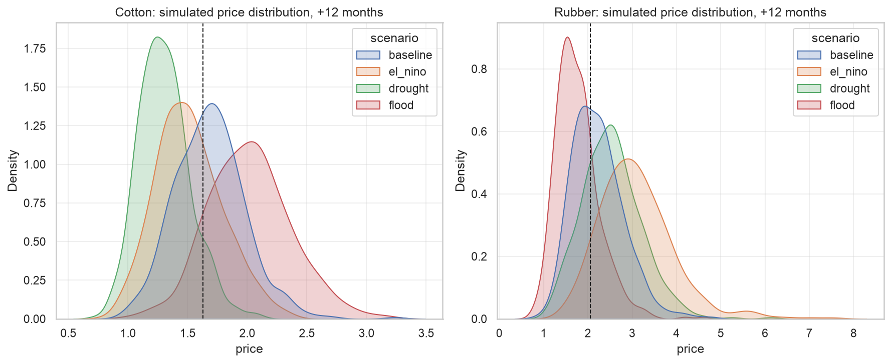

Six cells, six sign disagreements. A single "climate risk" model pooled across
both materials would average those effects toward zero and report that climate
doesn't matter much, which is a confident, well-validated, but completely wrong
answer. To counteract this, each commodity gets its own driver set, its own lag
structure, and its own horizons. The only shared component is the pipeline.

There's a second asymmetry worth stating, because it changes the modelling
target. A manufacturer that *buys* these materials is **structurally short**
both: only *upward* moves hurt. A symmetric price forecast spends half its
capacity on the half of the distribution nobody is exposed to. That's why Layer
2 predicts **spikes** rather than prices.

## 3. Climate leads price by about two quarters

Before modelling returns, the series have to justify it. Augmented Dickey-Fuller
puts cotton's price level at **−3.36** (`p=0.012`) and rubber's at **−2.82**
(`p=0.056`). Rubber fails to reject a unit root at 5%, cotton barely clears
it, while the log returns reject overwhelmingly (**−5.35** and **−12.84**). So
everything downstream models returns: SARIMAX(0,0,1) for cotton, SARIMAX(1,0,0)
for rubber, each with a curated exogenous set.

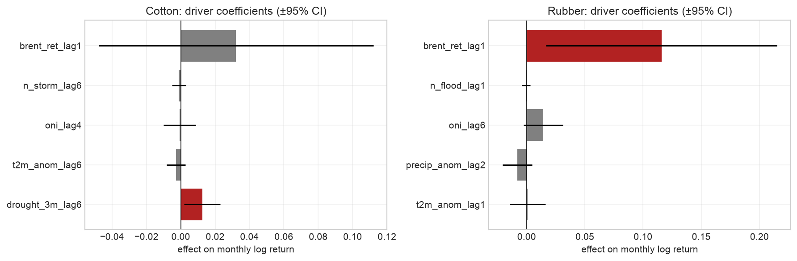

**For rubber, the causal test is clean.** ONI leads returns at **lag 6**
(`p=0.006`) while the reverse test sits at `p=0.45`. Rubber returns show no
sign of causing El Niño, which is the sanity check you want to see. The SARIMAX
coefficient agrees: `oni_lag6` is **+0.0143** (`p=0.094`). Two quarters is a lag
a procurement team can actually work inside.

**For cotton it looks similar and isn't.** Flood counts lead returns at lag 3
(`p=0.033`), ONI at lag 5 (`p=0.050`), and then the reverse placebo comes back
**significant too** (`p=0.030`). Cotton returns cannot cause floods. When a test
fires in both directions, it's describing a shared seasonal or macro confound,
not causation. So the cotton Granger evidence is reported as **suggestive, not
directional**, and I don't lean on it later.

The most interesting coefficient is one I expected to have the opposite sign.
`drought_3m_lag6` (higher = more rainfall) is **+0.0126** (`p=0.019`) for
cotton: *wetter* anomalies raise prices six months later. Most people (like me)
expect a drought to spike cotton prices. In Xinjiang's heavily irrigated
system, the mechanism appears to run the other way: excess rain at the wrong
point in the cycle disrupting harvest and quality. The temperature term keeps
its negative sign (`t2m_anom_lag6` **−0.0028**), but at `p=0.325` it carries no
weight, and I don't give it any.

**Rubber is not purely a climate story, and it would be dishonest to imply
otherwise.** `brent_ret_lag1` at **+0.1158** (`p=0.022`) is the largest
coefficient in either model: an order of magnitude above the ENSO term. Oil
raises the cost of synthetic rubber and drags natural rubber up with it. A
meaningful share of what looks like climate predictability is an
oil-substitution channel.

::: {layout-ncol=2}
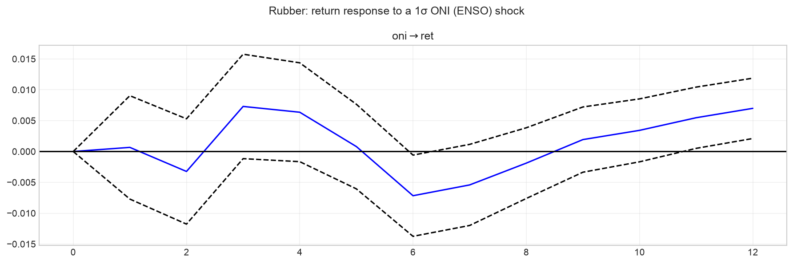

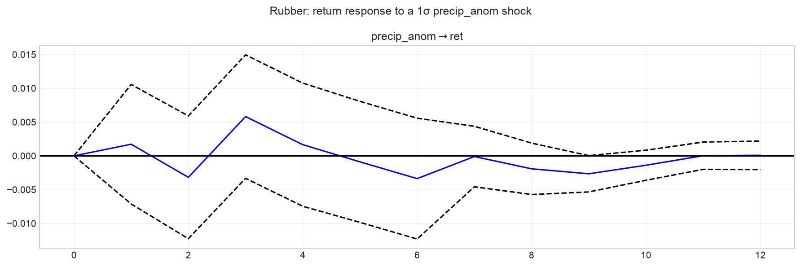

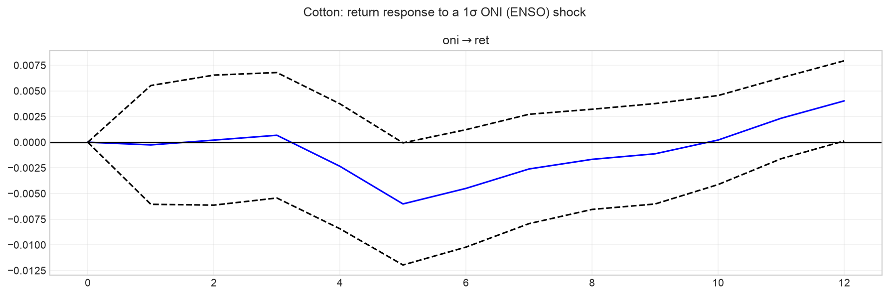

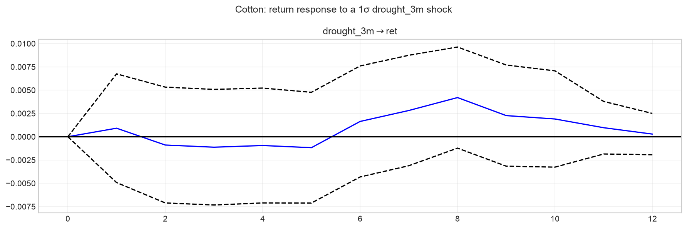
:::

**The impulse responses are an honest null.** Across VAR(6) for rubber and
VAR(8) for cotton, no orthogonalised IRF is distinguishable from zero at any
horizon -- every confidence band contains it. They're shown because they
corroborate direction, and they are explicitly *not* used to justify any
forecast horizon. Those rest on the Granger lags and the SARIMAX coefficients.

## 4. The alarm works for rubber — and only at three months for cotton

Layer 2 asks a different question of the same panel: **what is the probability
the price rises more than 10% at any point in the next `h` months?** The
label is a maximum over the window, not the end-to-end change, because a spike
that happens and reverses still hits a buyer who had to purchase during it.

Models are scored the way a weather warning is: not on accuracy, but on whether
they beat the base rate procurement already knows. Evaluation is walk-forward on
an expanding window, out-of-sample from 2016, against an expanding climatology
baseline.

| Commodity  |   h   | Model    |       AUC | Brier skill | Base rate |
| :--------- | :---: | :------- | --------: | ----------: | --------: |
| **Rubber** | **9** | Logistic | **0.775** |  **+0.182** |       56% |
| **Rubber** | **6** | Logistic | **0.740** |  **+0.111** |       45% |
| Rubber     |   3   | Logistic |     0.642 |      −0.000 |       28% |
| **Cotton** | **3** | XGBoost  | **0.622** |  **+0.030** |       19% |
| Cotton     |   9   | XGBoost  |     0.573 |      −0.001 |       41% |
| Cotton     |   6   | XGBoost  |     0.562 |      +0.017 |       37% |

Climatology sits at AUC 0.47-0.55 throughout, which is what a null should look
like. Cotton beyond three months is at or below it, and its logistic Brier skill
is outright **negative** at h=6 (−0.039) and h=9 (−0.100). **I don't recommend
acting on the cotton alarm at 6 or 9 months** -- a negative Brier skill score
means you'd have been better off quoting the base rate.

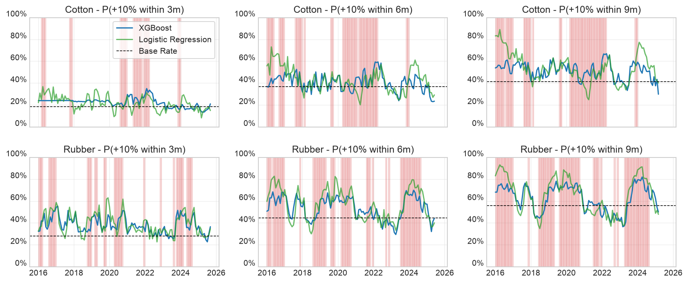

Shaded bands mark months where a +10% move did occur inside the horizon. A
useful alarm rises inside the shading and stays low outside it: visibly true
for rubber, visibly weak for cotton.

**Read every AUC against its own base rate.** They climb with the horizon:
cotton 19% up to 41%, rubber 28% up to **56%**. Rubber's h=9 skill is real, but
a +10% move within nine months is close to rubber's normal state, so the
*value* of knowing is lower than 0.775 suggests. That gap between skill and
usefulness turns out to be the whole story of the next section.

The drivers explain the split. For rubber, SHAP puts **three ENSO features in
the top four** (`oni`, `oni_lag6`, `oni_lag3`) with high ONI pushing the alarm
up, the same direction as SARIMAX's `+0.0143`, recovered by a different model
class on a different target. For cotton, the top driver is `mom_6m`, six-month
price momentum, at mean |SHAP| **0.194**, ahead of `oni` at **0.139**. Price
momentum outranks every climate feature.

::: {layout-ncol=2}
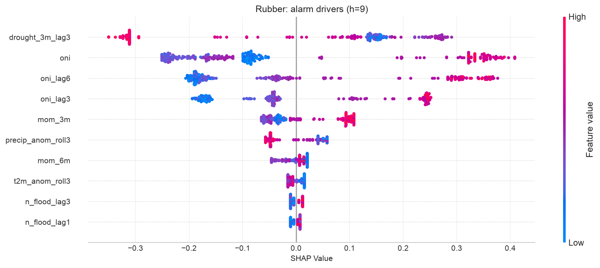

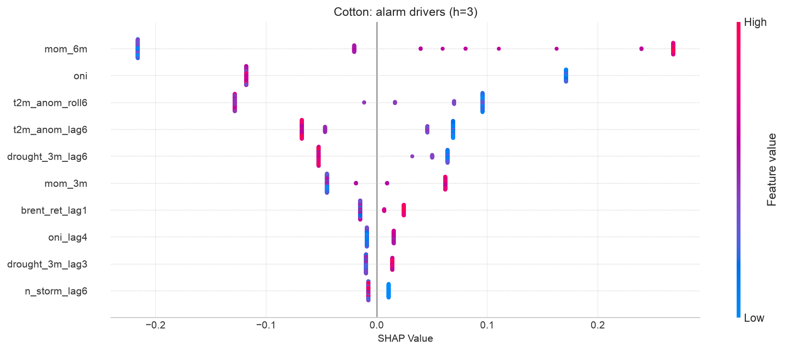
:::

A climate early-warning system whose cotton model is partly a momentum model is
a finding, not a bug. With only Xinjiang in view the climate signal is thin, and
the model falls back on what the price series says about itself.

Probabilities are conservative and rarely reach 50%, so the alarm fires at
**1.25× the historical base rate** rather than a fixed cutoff (e.g., "spike
risk is elevated 25% above normal." At that operating point, cotton h=3 crosses
at tau=0.24 and fires **54 alarms against 22 real events**, catching 13 with 41
false alarms. Rubber h=6 crosses at tau=0.56: **55 alarms, 51 events, 34 hits,
21 false**, a 67% hit rate.

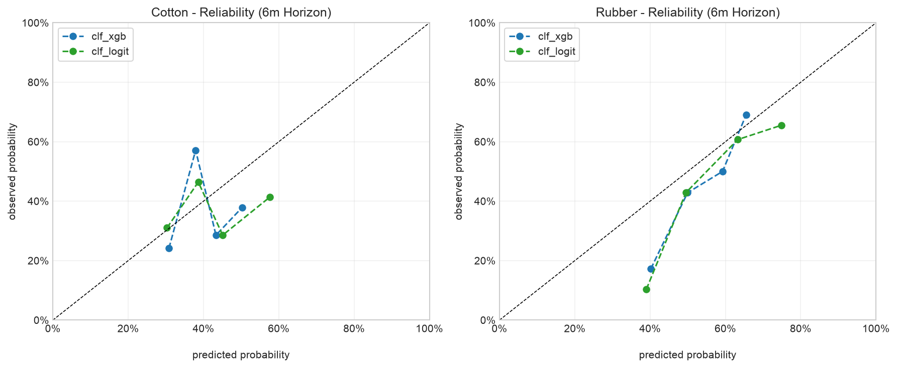

That cotton row is noisy on purpose. The rule is tuned to catch spikes, not to
avoid crying wolf, which is defensible only because forward-buying is cheap
relative to a missed +10% move. A team with expensive hedges would want a
higher multiple.

## 5. The finding I did not go looking for

Two results that started as footnotes turned out to be the same result, and it's
the most useful thing in the project.

Rubber's h=9 alarm has the study's best AUC (**0.775**) against a **56%** base
rate. Multiply that base rate by 1.25 and the firing threshold lands at **70%**.
A well-calibrated model asked about a coin-flip event essentially **never emits
a 70% probability**. The skill is real and the alarm is nearly mute.

Then the historical stress test made the same point, harder. I refit everything
through 2009-12 only and replayed the 2010-11 commodity spike, the most extreme
cotton move in a century, using the *actual* climate drivers of those months.

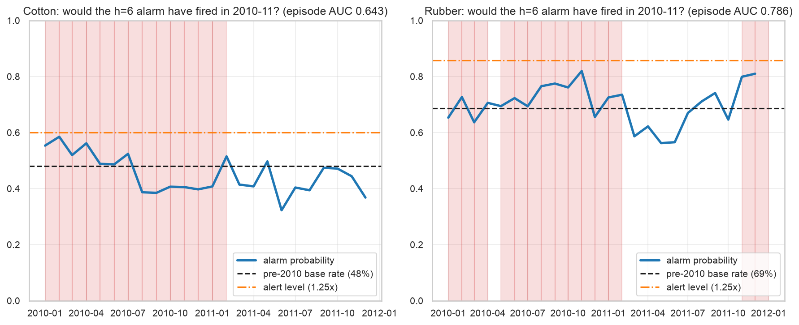

The alarm fired **0 times in 24 months, for both commodities.** But for opposite
reasons, and the difference matters:

- **Rubber's replay ranked the episode well.** Episode AUC **0.786**, peaking at
  **0.820** in November 2010. It never fired because the pre-2010 base rate was
  69%, putting the 1.25x bar at **0.858**, and the peak missed it by **0.038**.
  The signal was there. The rule suppressed it.
- **Cotton's replay ranked it weakly.** Episode AUC **0.643**, peak 0.585
  against a 0.600 bar. Closer in absolute terms, but on a near-uninformative
  ranking: firing would have been luck, not foresight.

Both are one mechanism: **multiplying a high base rate by a constant produces a
threshold the model cannot reach.** The relative rule is sound for rare events
(cotton at h=3, base rate 19%, threshold 0.24, perfectly reachable) and it
degrades precisely as the event becomes common, which is precisely when a buyer
most needs the warning.

**The fix is the alarm rule, not the model.** A fixed threshold, or one that
adapts sub-linearly to the base rate, would have fired for rubber in 2010-11. A
naive post-mortem would have blamed the data or the model; the operating rule
was vetoing a model that had the signal.

## 6. What to actually budget

Layer 3 turns all of it into numbers you can put in a plan. The SARIMAX spec is
refit, residuals are bootstrapped, and 10,000 paths run 12 months forward under
four named scenarios.

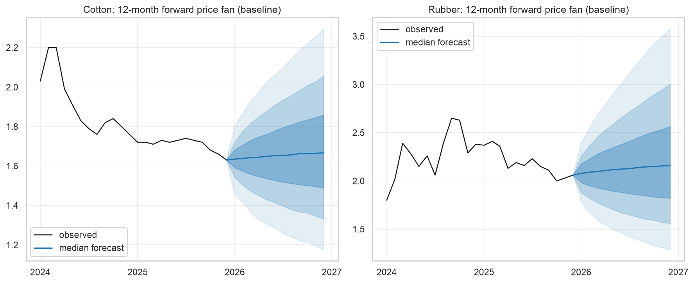

**Even the baseline is wide, and the width is the point.** At 12 months the 95%
band spans roughly −30% to +39% for cotton and −40% to +65% for rubber around
the median. Scenarios shift that distribution; they don't narrow it. Any
single-number forecast at this horizon is false precision.

The planning numbers, from today's anchor:

- **Rubber under a strong El Niño.** Six-month probability of a +10% move rises
  from a **35%** baseline to **69%**, and to **85%** at twelve months. Budget
  for **+61% at p95 within six months**, +118% at twelve.
- **Cotton's dangerous scenario is flood, not drought.** Six-month spike risk of
  **54%** against a 23% baseline — while drought *suppresses* it to about 3%.
  At p95, plan for **+34% at six months**, +62% at twelve.

That cotton line is the practical payoff of the counterintuitive coefficient in
section 3. A team hedging cotton against drought is hedging the wrong tail.

::: {.callout-warning title="What the forecast is anchored to"}
Every scenario above starts from a **2025-12** forecast origin — the last month
the full modelling panel covers, since the World Bank annual indicators and one
BLS producer price series both end there. Observed prices in the charts run
through **2026-06**, so the first six months of every forecast band already have
actuals sitting on top of them. That's deliberate and it's free out-of-sample
evidence, but read it as such: the model did not see those months.
:::

**The stress test is credible for rubber and humbling for cotton.** Replaying
2010-11 from a 2009-12 fit, rubber's realised path stayed inside the 95% band in
**92%** of months. Cotton managed **63%** — the peak of that spike escaped even
the widest band.

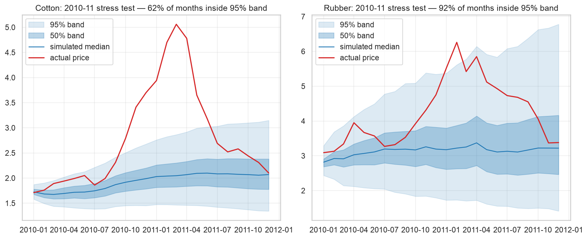

Bands built from bootstrapped historical residuals cannot anticipate a move
without precedent in the sample. Tail percentiles are planning aids, not
guarantees, and 2010-11 is the reminder.

Converting alarms to money: forward-buying on the XGBoost alarm at the 1.25×
rule would have saved **2.1%** of rubber procurement cost at h=6 and **1.9%** at
h=3, against **5.1%** under perfect foresight at h=6. Cotton is negligible
(**0.5%** at h=3, **0.4%** at h=6), consistent with its weaker skill. These are
directional figures, not a business case: they ignore inventory carrying cost,
liquidity and counterparty limits.

## 7. Where this breaks

The layers were built to be redundant: different targets, different methods,
different windows, so that an agreement would mean something. But **they are
not equally independent, and it would be easy to over-claim.** Layer 3's engine
*is* the Layer 1 SARIMAX spec, refit. When a scenario shifts a driver and the
price moves, it moves *because of* Layer 1's coefficient. That's arithmetic,
not confirmation. Only Layer 2 is actually independent: different model class,
different target, sharing nothing but the input panel.

Applying that test honestly splits the two headline findings:

- **"ENSO drives rubber" survives it.** Layer 1 has the Granger lag and the
  coefficient; Layer 2 independently puts three ENSO terms in its top four with
  the same sign. Two methods sharing only an input panel agree on the material,
  the direction, and roughly the lag. This is the strongest result in the study.
- **"Wet is bullish for cotton" is corroborated, but weakly.** The alarm model
  does now lean on `drought_3m_lag6` — it ranks 5th among cotton's drivers at
  mean |SHAP| **0.057**. That is actual cross-method agreement rather than one
  coefficient carrying the claim alone. Two things keep it short of settled: a
  feature ranking inside a *weak* model is weak corroboration, and cotton's
  Granger evidence is non-directional. The mechanism is plausible and now has
  two methods behind it; the causal claim rests on the mechanism, not on the
  identification.

::: {.callout-important title="Key Results"}
- **The same signal, opposite signs.** El Niño: rubber **+36.9%**, cotton
  **−10.9%** at 12 months. Six scenario cells, six sign disagreements — a pooled
  model would report that climate doesn't matter.
- **Climate leads price by about two quarters**, cleanly for rubber (ONI at lag
  6, `p=0.006`, reverse `p=0.45`) and non-directionally for cotton.
- **The rubber alarm is skillful** — AUC **0.775**, Brier skill **+0.182** at
  h=9 — and worth about **2.1%** of procurement cost at h=6. **Cotton's works
  only at three months.**
- **A relative alarm rule fails at high base rates.** A model that ranked the
  2010-11 spike at AUC **0.786** fired **0 of 24 months**, because scaling a 69%
  base rate put the bar at 0.858. The fix is the rule, not the model.
- **Cotton's climate coverage is Xinjiang only, ~20% of world production**, and
  nearly every cotton weakness above descends from it.
:::

## Limitations

**Cotton's coverage is the root cause of most of the rest.** Weak alarm skill, a
model whose top driver is price momentum, a stress test containing only 63% of
months — all downstream of seeing one-fifth of the crop. **The remedy is data,
not method:** extending ERA5 coverage to the US, Brazil, India and West Africa
is the single highest-value next step.

**Only one of three layers is an independent check.** Layer 3 inherits Layer 1's
coefficients, so its agreement is arithmetic. A future revision should give the
scenario engine a specification not borrowed from the econometrics.

**The relative alarm rule is mis-specified at high base rates** — diagnosed in
section 5, not fixed here.

**The most extreme move in a century escaped the 95% band**, and the IRFs
establish nothing. Neither is a reason to distrust the bands; both are reasons
not to treat them as coverage guarantees.

**Scope is narrower than the numbers imply.** Rubber is partly an oil story
(`brent_ret_lag1` +0.1158 is the largest coefficient anywhere in the model);
the procurement backtest ignores carry cost; and leather and petroleum-derived
synthetics are too sparse monthly to model at all.

## Closing thought

The result I'd keep if I could keep only one isn't the +36.9%. It's that a model
can be right and still be silent.

Rubber's 2010-11 replay had the signal: it ranked the episode at AUC 0.786 and
peaked within 0.038 of firing. Everything downstream of the model worked. The
thing that failed was a single line of business logic that multiplies a base
rate by 1.25, chosen because it was intuitive and never stress-tested at the
base rates where it would actually be used. A post-mortem that stopped at "the
alarm didn't fire" would have concluded the data was inadequate and gone looking
for more of it.

Most of the effort in a project like this goes into the model. The failure was
in the two-line rule sitting on top of it — and it was only visible because the
stress test replayed the *decision*, not just the *prediction*.

## Reproducing this analysis

Everything above runs from one public repository. There is no Databricks
dependency, no private package install, and no live API call in the modelling
path.

```{=html}
<div class="repo-card">
  <div class="repo-top">
    <i class="bi bi-github repo-icon" aria-hidden="true"></i>
    <a class="repo-name" href="https://github.com/msburns24/climate-commodity-risk">msburns24 /
      climate-commodity-risk</a>
  </div>
  <p class="repo-desc">Climate-driven price risk for cotton and natural rubber — a medallion ingestion
    pipeline, SARIMAX and VAR econometrics, walk-forward spike classifiers, and a Monte Carlo scenario
    engine. Run locally: <code>pip install -e . && make features</code></p>
  <div class="repo-tags">
    <span class="tag">python</span>
    <span class="tag">time-series</span>
    <span class="tag">econometrics</span>
    <span class="tag">xgboost</span>
    <span class="tag">monte-carlo</span>
  </div>
  <div class="repo-footer">
    <div class="repo-lang">
      <span class="lang-dot"></span>
      <span>Python</span>
    </div>
    <a class="view-btn" href="https://github.com/msburns24/climate-commodity-risk">
      View on GitHub <i class="bi bi-arrow-right" style="font-size:12px" aria-hidden="true"></i>
    </a>
  </div>
</div>
<br />
```

From a clean clone:

```bash
pip install -e .
make features                  # bronze -> silver -> gold
python -m src.modeling.train   # SARIMAX + walk-forward classifiers
python -m src.modeling.predict # Monte Carlo scenarios
```

Every figure and number in this post is produced by a cell in one of three
notebooks, each ending in a Findings cell whose values trace to a cell output in
the same run:

| Notebook | Produces |
| --- | --- |
| [`modeling_1_econometrics.ipynb`](https://github.com/msburns24/climate-commodity-risk/blob/main/notebooks/modeling_1_econometrics.ipynb) | ADF, Granger, SARIMAX coefficients, IRFs |
| [`modeling_2_early_warning.ipynb`](https://github.com/msburns24/climate-commodity-risk/blob/main/notebooks/modeling_2_early_warning.ipynb) | Skill table, alarm timeline, SHAP, calibration, backtest |
| [`modeling_3_scenarios.ipynb`](https://github.com/msburns24/climate-commodity-risk/blob/main/notebooks/modeling_3_scenarios.ipynb) | Fan charts, scenario shifts, stress test, alarm replay |

Every tunable (driver sets, lags, horizons, the +10% threshold, the 1.25×
alarm multiple, hyperparameters) lives in `src/config.py`, so none of the
numbers above are hardcoded in a notebook.

**No raw data ships with the repo.** Each source carries its own license, and
two need care: EM-DAT permits publishing aggregate statistics but not
redistribution, and the IMF commodity price series distributed through FRED
can't be republished at all, which is why the prices here come from the World
Bank Pink Sheet instead.
[`DATA.md`](https://github.com/msburns24/climate-commodity-risk/blob/main/DATA.md)
carries the full table, the attribution strings, and instructions for
regenerating everything yourself.

::: {.callout-tip title="Try it yourself"}
The **[interactive dashboard](dashboard.qmd)** runs every model in this post in
your browser: drag a severity dial through the scenario grid, move the alarm
threshold and watch the confusion counts recompute, and replay the procurement
backtest at your own spend.
:::

## Data sources

- **ERA5 reanalysis** — Copernicus Climate Change Service (C3S) Climate Data
  Store, DOI `10.24381/cds.adbb2d47`. Licensed CC-BY.
- **World Bank Commodity Price Data ("Pink Sheet")** — cotton A Index and rubber
  RSS3, monthly, in $/kg. Licensed CC-BY 4.0.
- **NOAA Climate Prediction Center** — Oceanic Niño Index. Public domain.
- **EM-DAT**, the International Disaster Database — Emergency Events Database,
  UCLouvain / CRED, Brussels, Belgium, accessed 2026-07-25,
  [www.emdat.be](https://www.emdat.be). Used as monthly aggregate counts only.
- **U.S. Bureau of Labor Statistics via FRED** — producer price indices and
  CPI-U. Public domain.

::: {.callout-note appearance="simple"}
This began as a graduate capstone project in UNC's School of Data & Information
Science, **sponsored by Nike**: they set the brief, served as project
stakeholder, and we worked with them directly throughout. Teammates built the
Streamlit application and the country-level data exploration.

The write-up and dashboard here are my own, and Nike has not reviewed or
endorsed this post specifically. No proprietary Nike data appears anywhere in
the project. Every input is one of the public sources listed above.
:::
